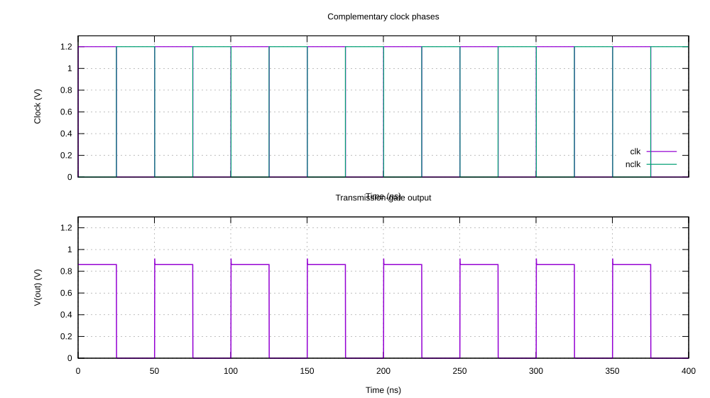

Simulation using Gnucap
**************************

.. _gnucap_configuration_lbl:

Introduction to Gnucap
======================

Gnucap circuit simulator is an open-source modern circuit simulator with support for
VerilogAMS. It is hosted at several mirrors but the most up to dater is the one on
`codeberg <https://codeberg.org/gnucap/gnucap>`_. The documentation is fragmented
and the adoption in open source EDA tools is limited. However, gnucap is a powerful
tool especially for mixed signal simulation.

Gnucap and gnucap-modelgen-verilog installation on ubuntu 22.04 LTS
====================================================================

Due to gnucap's modular architecture the installation process consists of two basic steps:

#. installation of gnucap - main application
#. installation of gnucap-modelgen-verilog - Verilog-AMS model generator/compiler

The gnucap installation is straightforward.
The source code can be obtained from `this repository <https://codeberg.org/gnucap/gnucap>`_.
In order to install gnucap the following commands should be executed:

.. code-block:: bash

    cd
    git clone https://codeberg.org/gnucap/gnucap.git gnucap
    cd gnucap
    mkdir build
    cd build
    ../configure
    make
    sudo make install

The same method applies to the gnucap-modelgen-verilog tool,
which can be obtained from `this website <https://codeberg.org/gnucap/gnucap-modelgen-verilog>`_.
It is used to compile Verilog-AMS models to be included in gnucap simulation engine.

.. code-block:: bash

    cd
    git clone https://codeberg.org/gnucap/gnucap-modelgen-verilog.git gnucap-modelgen-verilog
    cd gnucap-modelgen-verilog
    mkdir build
    cd build
    ../configure
    make
    sudo make install

Gnucap PDK settings
===================

The Verilog-A models for gnucap have to be compiled using the make build system after
cloning the PDK. The detailed instructions are in the main README file under
``$PDK_ROOT/$PDK/libs.tech/gnucap``. The last part is to export environmental
variables by adding them to your ``.bashrc`` following the example:

.. code-block:: bash

    export GNUCAP_PLUGPATH="$PDK_ROOT/$PDK/libs.tech/gnucap/plugins/models:/usr/local/lib/gnucap"
    export GNUCAP_INCLUDEPATH="$PDK_ROOT/$PDK/libs.tech/gnucap/models:/usr/local/include/gnucap"

Gnucap basic example
====================

There are not many basic or medium-level examples in the public space showing how to
simulate circuits with gnucap. This section presents a basic example using an IHP SG13G2
low-voltage NMOS device. The example performs a nested DC sweep of the drain-source
voltage for several gate-source voltages.

.. note::

   Gnucap is interactive and has a unique feature, where you can switch between netlist formats at runtime.
   Currently it supports Spice, Verilog-AMS and spectre formats.

The following netlist can be saved as ``nmos.gc``. It uses the PDK-generated parameter
set plugin and Verilog-A module files. These files are available after building the
Gnucap models as described in :ref:`gnucap_configuration_lbl`.

.. code-block:: verilog

    // Verilog mode
    verilog
    load mgsim
    load vams/vpulse.so
    load sg13g2_moslv_paramset.so
    include sg13g2_moslv_module.va
    options log

    // Circuit in Verilog-AMS style
    ground gnd;
    include cornerMOSlv.va
    moslv_tt corner_moslv();

    sg13_lv_nmos #(.w(1.0e-6), .l(0.13e-6), .ng(1), .mm_ok(0)) XM1(nd, ng, gnd, gnd);

    // Voltage sources in Spice style
    spice
    Vgs ng gnd 0.4
    Vds nd gnd 1.2

    // Simulation setup in Spice style
    .print dc ids(XM1.*) v(nodes)
    .dc Vds 0 1.2 0.01 Vgs 0.0 0.8 0.05 > dcnmos.txt

Gnucap uses C/C++ style comments (//) for verilog mode and spice style comments (// and \*) for spice mode.
The ``verilog`` keyword switches gnucap to verilog-ams mode, while the ``spice`` keyword switches gnucap to spice mode.
The ``load`` command loads the required plugins. The ``sg13g2_moslv_paramset.so`` plugin
and the ``sg13g2_moslv_module.va`` module provide the PDK MOS model, while
``cornerMOSlv.va`` and ``moslv_tt`` select the typical low-voltage model corner.
The ``options log`` command enables logging of the simulation progress.

The circuit contains one ``sg13_lv_nmos`` transistor. Its drain is connected to ``nd``,
its gate to ``ng``, and its source and bulk to ``gnd``. ``Vgs`` and ``Vds`` are the two
voltage sources used by the nested DC sweep. The result is written to ``dcnmos.txt``.
The simulation can be run and plotted with:

.. code-block:: bash

    gnucap nmos.gc
    gnuplot nmos.gp

The first lines of ``dcnmos.txt`` are:

.. code-block:: text

    #           ids(XM1.Nsg13_lv_nmos) v(gnd)     v(nd)      v(ng)
     0.         0.         0.         0.         0.
     0.01       1.74E-12   0.         0.01       0.
     0.02       3.003E-12  0.         0.02       0.
     0.03       3.921E-12  0.         0.03       0.

One of the easiest ways to plot the data is to use either Python matplotlib or gnuplot.
The following script plots the drain current versus ``Vds`` for different ``Vgs`` values.
The supplied ``nmos.gp`` script generates a PDF; the SVG settings below can be enabled
instead when an SVG output is needed.

.. code-block:: gnuplot

    # For PDF output
    #set terminal pdfcairo size 800,600
    #set output "sg13_lv_nmos.pdf"
    # For SVG output
    set terminal svg size 800,600
    set output "sg13_lv_nmos.svg"

    set multiplot layout 1,1 title "Drain current of low voltage nmos transistor sg13\\_lv\\_nmos"

    set grid
    set ylabel "I_{ds} (A)"
    set xlabel "V_{ds} (V)"
    unset key
    plot "dcnmos.txt" using 1:2 with points pt 3 ps 0.3

    unset multiplot
    set output

The resulting plot is shown below:

.. image:: ../_static/sg13_lv_nmos.svg
    :align: center
    :alt: Gnucap nested DC sweep

Compiling a Verilog-A model to be used in a simulation
======================================================

The ``gnucap-modelgen-verilog`` tool compiles Verilog-A and Verilog-AMS models into
shared objects that can be loaded by Gnucap. The transmission-gate example contains
three models:

* ``elect_to_logic.vams`` converts an electrical signal to a logic signal.
* ``logic_to_elect.vams`` converts a logic signal to an electrical signal.
* ``tgate.va`` implements a CMOS transmission gate using IHP SG13G2 devices.

The following ``build.sh`` script compiles all three models. The ``GNUGCAP_INC`` and
``GNUGCAP_VAMS`` variables can be used to select a non-default Gnucap installation.

.. code-block:: bash

    #!/bin/sh
    set -e

    GNUGCAP_INC="${GNUGCAP_INC:-/usr/local/include/gnucap}"
    GNUGCAP_VAMS=${GNUGCAP_VAMS:-gnucap-mg-vams}

    build_model() {
        src="$1"
        out="$2"
        "$GNUGCAP_VAMS" -I "$GNUGCAP_INC" --cc "$src" |
            g++ -xc++ -I"$GNUGCAP_INC" -DNDEBUG -O2 -fPIC -shared - -o "$out"
    }

    build_model elect_to_logic.vams elect_to_logic.so
    build_model logic_to_elect.vams logic_to_elect.so
    build_model tgate.va tgate.so

The electrical-to-logic connectmodule uses the thresholds from the Gnucap logic model
to convert the electrical input into a logic state:

.. code-block:: verilog

    `include "disciplines.vams"

    // Electrical-to-logic connectmodule.
    connectmodule elect_to_logic(el, cm);
        input el;
        output cm;
        logic cm;
        electrical el;
        reg state;
        logic state;

        initial state = 0;
        always @(above(V(el) - 0.85)) state = 1;
        always @(above(0.25 - V(el))) state = 0;
        assign cm = state;
    endconnectmodule

The logic-to-electrical connectmodule generates a voltage transition for each logic edge:

.. code-block:: verilog

    `include "disciplines.vams"

    // Logic-to-electrical connectmodule.
    connectmodule logic_to_elect(cm, el);
        parameter real v0 = 0.0;
        parameter real v1 = 1.2;
        parameter real tr = 10p;
        parameter real tf = 10p;
        input cm;
        output el;
        logic cm;
        electrical el;
        (* _state="yes", desc="outval" *) real out_val;

        analog initial out_val = v0;
        always @(posedge(cm)) out_val = v1;
        always @(negedge(cm)) out_val = v0;

        analog begin
            V(el) <+ transition(out_val, 0, tr, tf);
        end
    endconnectmodule

The transmission-gate model combines complementary low-voltage NMOS and PMOS devices.
The clock signals are converted to electrical controls before driving the MOS gates.
The resistor provides a load from the output to ``vss``.

.. code-block:: verilog

    `include "disciplines.vams"

    // Basic complementary transmission gate for the IHP SG13G2 process.
    module tgate(vdd, vss, in, out, clk, nclk);
        inout vdd, vss, in, out;
        input clk, nclk;
        logic clk, nclk;
        electrical vdd, vss, in, out, clk_e, nclk_e;

        logic_to_elect #(.v0(0.0), .v1(1.2), .tr(10p), .tf(10p))
            clk_converter(clk, clk_e);
        logic_to_elect #(.v0(0.0), .v1(1.2), .tr(10p), .tf(10p))
            nclk_converter(nclk, nclk_e);

        // The complementary gates keep the switch conducting across the full
        // signal range from vss to vdd.
        sg13_lv_nmos #(.w(1u), .l(0.13u), .ng(1), .mm_ok(0)) MN(in, clk_e, out, vss);
        sg13_lv_pmos #(.w(2u), .l(0.13u), .ng(1), .mm_ok(0)) MP(out, nclk_e, in, vdd);

        resistor #(.r(10k)) r1(out, vss);
    endmodule

The generated schematic of the transmission gate is shown below:

The testbench instantiates the transmission gate, supplies a constant 1 V input, and
generates complementary clock phases. The electrical clock sources are converted to
logic signals before they are connected to the transmission-gate model.

.. code-block:: verilog

    // Load model plugins.
    load sg13g2_moslv_paramset.so
    load vams/vpulse.so
    load ./elect_to_logic.so
    load ./logic_to_elect.so
    load ./tgate.so

    include sg13g2_moslv_module.va

    module tb_tgate(in, out, clk, nclk);
        inout in, out;
        output clk, nclk;
        logic clk, nclk;
        ground gnd;
        electrical vdd, vss, out, in, clk_drive, nclk_drive;

        tgate tg(vdd, vss, in, out, clk, nclk);
        vsource #(.dc(1.2)) vdd1(vdd, gnd);
        vsource #(.dc(0.0)) vss1(vss, gnd);
        vpulse #(.val0(0.0), .val1(1.2), .rise(10p), .fall(10p), .width(25n), .period(50n)) clk_source(clk_drive, gnd);
        vpulse #(.val0(1.2), .val1(0.0), .rise(10p), .fall(10p), .width(25n), .period(50n)) nclk_source(nclk_drive, gnd);
        elect_to_logic clk_converter(clk_drive, clk);
        elect_to_logic nclk_converter(nclk_drive, nclk);
        vsource #(.dc(1.0)) vin(in, gnd);
    endmodule

The Gnucap control file loads the simulator plugins, selects the model corners, and
performs a 400 ns transient analysis. It also writes a VCD file named ``tgate.vcd``
and a tabular output file named ``tgate-tran.txt``.

.. code-block:: text

    // Functional testbench for the complementary transmission gate.
    load mgsim
    options abstol=1n
    options trtol=2.0
    options gmin=1n
    options itl6=250
    options method=gear
    options noincmode
    verilog
    load logic/gnucap-logic.so
    load plugins/out/outputvcd.so

    include ./tb_tgate.va

    include cornerRES.va
    include cornerMOSlv.va
    include cornerCAP.va

    res_typ corner_res();
    cap_typ corner_cap();
    moslv_tt corner_moslv();

    .model logic logic delay=100p rise=10p fall=10p vmax=1.2 vmin=0.0 thh=0.85 thl=0.25
    tb_tgate tb(in, out, clk, nclk);
    print tran v(in) v(out) l(clk) l(nclk) iter(0)
    outputvcd tgate 100ps
    tran 100p 400n > tgate-tran.txt
    status notime

The example can be built and run with:

.. code-block:: bash

    ./run.sh
    gnuplot tgate.gp

The first lines of ``tgate-tran.txt`` are:

.. code-block:: text

    #Time       v(in)      v(out)     l(clk)     l(nclk)    iter(0)
     0.         1.         0.86161    0.         0.         9.
     100.E-12   1.         0.86161    1.         0.         38.
     200.E-12   1.         0.86167    3.         0.         32.
     300.E-12   1.         0.86173    3.         0.         4.

The ``tgate.gp`` script plots the complementary clock phases and the transmission-gate
output. It writes both PDF and SVG versions of the figure.

.. code-block:: text

    # Plot the complementary clock phases and transmission-gate output.
    set datafile commentschars "#"
    set xrange [0:400]
    set yrange [0:1.3]
    set grid

    set terminal pdfcairo enhanced color size 8in,4.5in
    set output "tgate.pdf"
    set multiplot layout 2,1 margins 0.11,0.97,0.10,0.91 spacing 0.08,0.10
    set ylabel "Clock (V)"
    set format x ""
    set key bottom right
    set title "Complementary clock phases"
    plot "tgate-tran.txt" using ($1*1e9):($4 > 0 ? 1.2 : 0) with steps lw 1.2 title "clk", \
         "tgate-tran.txt" using ($1*1e9):($5 > 0 ? 1.2 : 0) with steps lw 1.2 title "nclk"

    set xlabel "Time (ns)"
    set ylabel "V(out) (V)"
    set format x "%g"
    unset key
    set title "Transmission-gate output for a constant 1 V input"
    plot "tgate-tran.txt" using ($1*1e9):3 with lines lw 1.5 title "V(out)"

    unset multiplot

    set terminal svg enhanced size 1000,560 dynamic
    set output "tgate.svg"
    set multiplot layout 2,1 margins 0.11,0.97,0.10,0.91 spacing 0.08,0.10
    set ylabel "Clock (V)"
    set format x ""
    set key bottom right
    set title "Complementary clock phases"
    plot "tgate-tran.txt" using ($1*1e9):($4 > 0 ? 1.2 : 0) with steps lw 1.2 title "clk", \
         "tgate-tran.txt" using ($1*1e9):($5 > 0 ? 1.2 : 0) with steps lw 1.2 title "nclk"

    set xlabel "Time (ns)"
    set ylabel "V(out) (V)"
    set format x "%g"
    unset key
    set title "Transmission-gate output"
    plot "tgate-tran.txt" using ($1*1e9):3 with lines lw 1.5 title "V(out)"
    unset multiplot

    set output

The SVG output of the transient simulation is shown below:

When ``clk`` is high and ``nclk`` is low, the complementary MOS devices conduct and
the input is transferred to the output. When the clock phases are reversed, the gate
is off and the output is pulled toward ``vss`` by the 10 kOhm resistor. The simulated
high level is below 1 V because of the device models and the resistive load.

.. note:: Conclusions

   This example demonstrates a mixed-signal Verilog-AMS hierarchy in Gnucap. The
   connectmodules bridge logic and electrical signals, while the transmission gate
   itself is built from SG13G2 transistor models and a resistor. The testbench uses
   a transient analysis and exports both tabular data and a VCD waveform file.

References
==========

You can find some more resources here:

#. Official documentation Gnucap_
#. Source code + test suites CodebergSite_
#. FOSDEM 2018 Gnucap talk Fosdem2018_
#. FOSDEM 2017 Gnucap talk Fosdem2017_
#. IGER 2023 Gnucap talk IGER2023_
#. An overview of algorithms in Gnucap IEEE2023_
#. The gnucap model compiler IEEE2022_

.. _Gnucap: http://gnucap.org
.. _CodebergSite: https://codeberg.org/gnucap/
.. _Fosdem2018: https://www.youtube.com/watch?v=5a1N_Dm1muc
.. _Fosdem2017: https://www.youtube.com/watch?v=zyeMORbswKk
.. _IGER2023: https://www.youtube.com/watch?v=nacG9UwvoLw
.. _IEEE2023: https://ieeexplore.ieee.org/document/1225766
.. _IEEE2022: https://ieeexplore.ieee.org/abstract/document/1291068/
