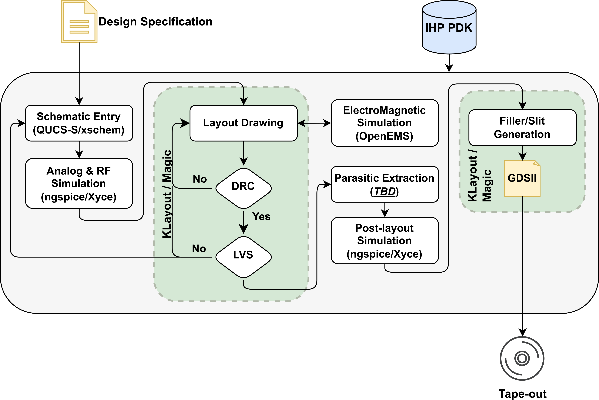

Designing Using Qucs-S
======================

Qucs-S (Quite Universal Circuit Simulator - SPICE) is a fork of the Qucs project that integrates SPICE simulation capabilities. Unlike the original Qucs, which
uses its own solver, Qucs-S allows users to simulate circuits using a variety of SPICE engines like Ngspice, Xyce, or any other SPICE-compatible simulator. This
makes it versatile for both analog and digital circuit simulation. Qucs-S maintains the same graphical user interface (GUI) as Qucs, enabling schematic capture,
simulation, and waveform viewing in a user-friendly environment, but with the added flexibility of SPICE simulation. Qucs-S has also a "look & feel" like a
proprietary ADS tool.

