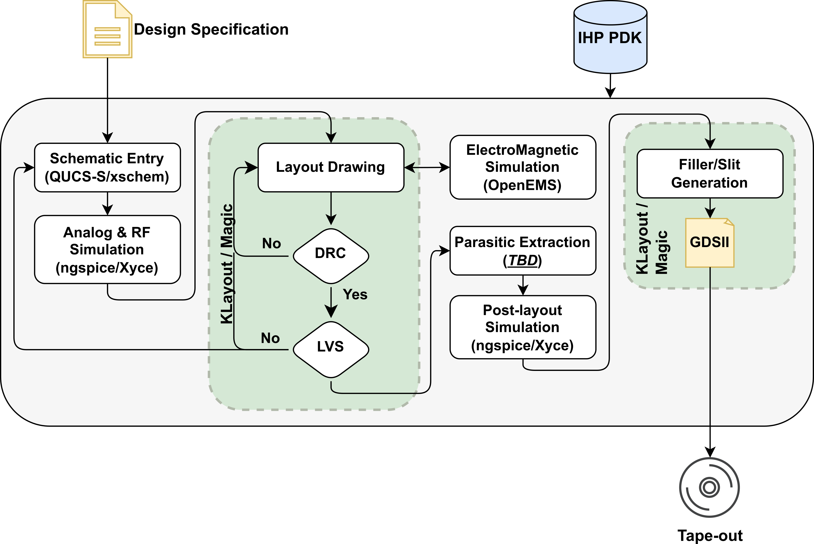

Analog/Mixed/RF flow based on Klayout
=====================================

The proposal of the flow is shown on the following image.

As it is shown we support multiple tools for schematic capture, simulation, layout editing and physical 
verification. Each tool will be described separately in this documentation. The mixed signal design and RF 
design are variations of the presented flow. 

