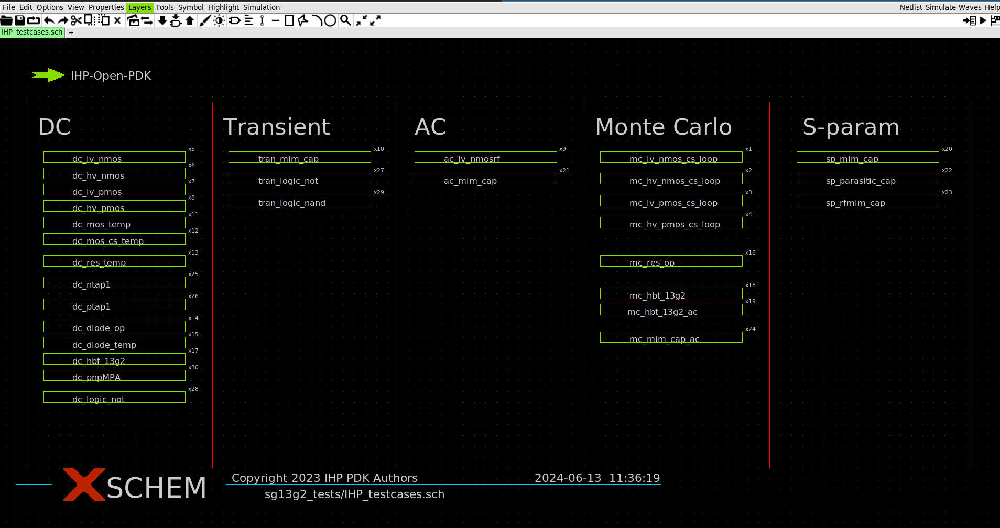

Schematic capture using XSCHEM
===============================

.. _xschem_configuration_lbl:

XSCHEM installation and configuration
-------------------------------------

XSCHEM is an open source schematic capture tool hosted `here <https://xschem.sourceforge.io/stefan/index.html>`_.
It is capable to stream a customizable netlist, interoperates with simulators and post process the simulation results. 
To be used with IHP-Open-PDK it is strongly recommended to install xschem from sources using the latest release hosted on 
`github <https://github.com/StefanSchippers/xschem>`_.

After successful installation you can call the following command in the ``PDK_ROOT/ihp-sg13g2/libs.tech/xschem/`` directory:

.. code-block:: shell

    python3 install.py

It will compile and install a **psp103_nqs.osdi** binary and place it in ``$PDK_ROOT/$PDK/ngspice/openvaf/`` directory. The file is mandatory for a simulation of our mosfet devices.
The script will also creates a symbolic link to the  ``$PDK_ROOT/$PDK/ngspice/.spiceinit`` file in your home directory. This approach permits to simulate circuits containing elements 
form IHP-Open-PDK in any directory.  
After this step you can call ``xschem &`` command to run the tool, what will bring the top level hierarchy schematic with a couple of examples segmented by simulation type.

XSCHEM symbol library
---------------------
The IHP-Open-PDK delivers a symbol library which can be found in ``$PDK_ROOT/$PDK/libs.tech/xschem/sg13g2_pr`` directory and it contains the following devices.

+--------------+-----------------------------------------------------------------------------------------------------------------------------------------------+--+
| Device       | Description                                                                                                                                   |  |
+==============+===============================================================================================================================================+==+
| npn13g2      | HBT NPN bipolar transistor device with a Nx-number of devices parameter                                                                       |  |
+--------------+-----------------------------------------------------------------------------------------------------------------------------------------------+--+
| npn13g2l     | HBT NPN bipolar transistor device with a Nx-number of devices and El-emitter length parameters                                                |  |
+--------------+-----------------------------------------------------------------------------------------------------------------------------------------------+--+
| npn13g2v     | HBT NPN bipolar transistor device with a Nx-number of devices parameter, device for high power and lower frequency applications               |  |
+--------------+-----------------------------------------------------------------------------------------------------------------------------------------------+--+
| sg13_lv_nmos | N-channel, low voltage parametrizable mosfet device. W-channel width, L-channel length, ng-number of gates, m-number of devices               |  |
+--------------+-----------------------------------------------------------------------------------------------------------------------------------------------+--+
| sg13_hv_nmos | N-channel, high voltage parametrizable mosfet device. W-channel width, L-channel length, ng-number of gates, m-number of devices              |  |
+--------------+-----------------------------------------------------------------------------------------------------------------------------------------------+--+
| sg13_lv_pmos | P-channel, low voltage parametrizable mosfet device. W-channel width, L-channel length, ng-number of gates, m-number of devices               |  |
+--------------+-----------------------------------------------------------------------------------------------------------------------------------------------+--+
| sg13_hv_pmos | P-channel, high voltage parametrizable mosfet device. W-channel width, L-channel length, ng-number of gates, m-number of devices              |  |
+--------------+-----------------------------------------------------------------------------------------------------------------------------------------------+--+
| rsil         | Silicide resistor of a sheet resistance of 7 $\Omega / \square$                                                                               |  |
+--------------+-----------------------------------------------------------------------------------------------------------------------------------------------+--+
| rppd         | Polysilicon resistor of a sheet resistance of 7 $\Omega / \square$                                                                            |  |
+--------------+-----------------------------------------------------------------------------------------------------------------------------------------------+--+
| rhigh        | Polysilicon resistor of a high sheet resistance of 1360 $\Omega / \square$                                                                    |  |
+--------------+-----------------------------------------------------------------------------------------------------------------------------------------------+--+
| ntap1        | N-well difussion conntact resistance  of 262 $\Omega$                                                                                         |  |
+--------------+-----------------------------------------------------------------------------------------------------------------------------------------------+--+
| ptap1        | P-well (substrate) difussion conntact resistance  of 262 $\Omega$                                                                             |  |
+--------------+-----------------------------------------------------------------------------------------------------------------------------------------------+--+
| cap_cmim     | Metal-Insulator-Metal capacitor                                                                                                               |  |
+--------------+-----------------------------------------------------------------------------------------------------------------------------------------------+--+
| cap_cpara    | Parasitic capacitor symbol attached to a model (used only for parasitics extraction)                                                          |  |
+--------------+-----------------------------------------------------------------------------------------------------------------------------------------------+--+
| cap_rfcmim   | Metal-Insulator-Metal capacitor model for RF                                                                                                  |  |
+--------------+-----------------------------------------------------------------------------------------------------------------------------------------------+--+
| dantenna     | Antenna diode symbol. This diode is used to protect against low voltage. The anode of the diode should be connected to the ptap1 resistor.    |  |
+--------------+-----------------------------------------------------------------------------------------------------------------------------------------------+--+
| dpantenna    | Antenna diode symbol. This diode is used to protect against high voltage. The cathode of the diode should be connected to the ntap1 resistor. |  |
+--------------+-----------------------------------------------------------------------------------------------------------------------------------------------+--+
| pnpMPA       | pnp HBT used for band-gap reference circuit                                                                                                   |  |
+--------------+-----------------------------------------------------------------------------------------------------------------------------------------------+--+

XSCHEM testcases
----------------
The top level schematic, namely IHP_testcases.sch,can be found at ``PDK_ROOT/$PDK/libs.tech/xschem/sg13g2_tests`` directory. 
By default each test case exports the netlist to the ``simulations/`` subdirectory, where NGSpice is called in order to perform the simulation. 
The raw files generated using simulations are placed in the same folder. If a test case exports CSV file it will be placed in a ``csv/`` directory. 
The ``scripts/`` folder contains python scripts, which are used for CSV data post processing. All plots generated by the scripts are exported to the ``fig/`` folder. 

XSCHEM standard cell library
-----------------------------
To be developed

XSCHEM IO cell library
-----------------------------
To be developed
