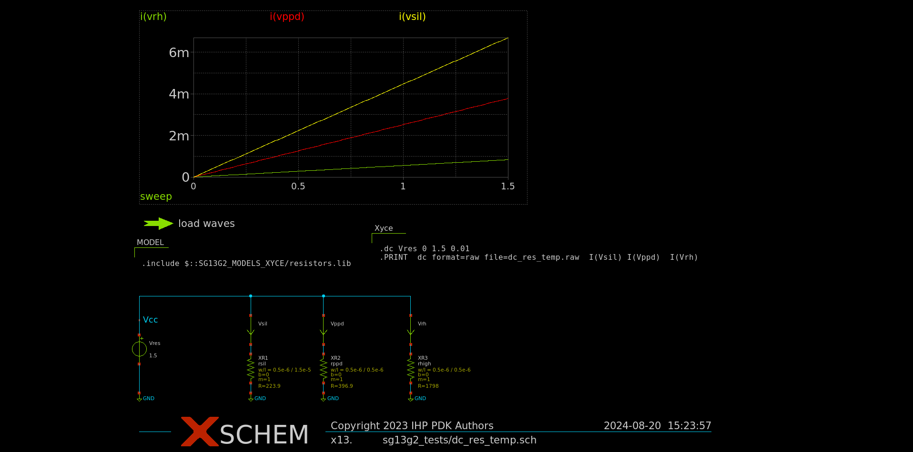

Simulation using Xyce
*********************

.. _xyce_configuration_lbl:

XYCE installation on ubuntu 22.04 LTS 
======================================

Xyce installation is demanding due to the specific version isssues and multiple dependencies.
Apart the bulid requirements listed in the `building guide <https://xyce.sandia.gov/documentation-tutorials/building-guide/>`_ the key parts for insallation are:

#. installation of trilinos 
#. installation of ADMS
#. installation of Xyce

Trilinos installation
------------------------

First of all one have to obtain the **exact** version of trilinos **12.12.1**

.. code-block:: bash
    
    cd 
    git clone https://github.com/trilinos/Trilinos.git Trilinos
    cd Trilinos
    git checkout trilinos-release-12-12-1
    
Since it is recommended to build trilinos out of the source code directory one can execute the following

.. code-block:: bash
    
    cd 
    mkdir trilinos_build
    cd trilinos_build
    touch reconfigure.sh 
    chmod +x reconfigure.sh 

The content of the file `reconfigure.sh` is listed below:

.. code-block:: bash
    
  #!/bin/sh
  SRCDIR="$HOME/Trilinos/"
  ARCHDIR="/usr/local"
  FLAGS="-O3 -fPIC"
  cmake \
  -DCMAKE_C_COMPILER=gcc \
  -DCMAKE_CXX_COMPILER=g++ \
  -DCMAKE_Fortran_COMPILER=gfortran \
  -DCMAKE_CXX_FLAGS="$FLAGS" \
  -DCMAKE_C_FLAGS="$FLAGS" \
  -DCMAKE_Fortran_FLAGS="$FLAGS" \
  -DCMAKE_INSTALL_PREFIX=$ARCHDIR \
  -DCMAKE_MAKE_PROGRAM="make" \
  -DTrilinos_ENABLE_NOX=ON \
    -DNOX_ENABLE_LOCA=ON \
  -DTrilinos_ENABLE_EpetraExt=ON \
    -DEpetraExt_BUILD_BTF=ON \
    -DEpetraExt_BUILD_EXPERIMENTAL=ON \
    -DEpetraExt_BUILD_GRAPH_REORDERINGS=ON \
  -DTrilinos_ENABLE_TrilinosCouplings=ON \
  -DTrilinos_ENABLE_Ifpack=ON \
  -DTrilinos_ENABLE_AztecOO=ON \
  -DTrilinos_ENABLE_Belos=ON \
  -DTrilinos_ENABLE_Teuchos=ON \
  -DTrilinos_ENABLE_COMPLEX_DOUBLE=ON \
  -DTrilinos_ENABLE_Amesos=ON \
    -DAmesos_ENABLE_KLU=ON \
  -DTrilinos_ENABLE_Amesos2=ON \
   -DAmesos2_ENABLE_KLU2=ON \
   -DAmesos2_ENABLE_Basker=ON \
  -DTrilinos_ENABLE_Sacado=ON \
  -DTrilinos_ENABLE_Stokhos=ON \
  -DTrilinos_ENABLE_Kokkos=ON \
  -DTrilinos_ENABLE_ALL_OPTIONAL_PACKAGES=OFF \
  -DTrilinos_ENABLE_CXX11=ON \
  -DTPL_ENABLE_AMD=ON \
  -DAMD_LIBRARY_DIRS="/usr/lib" \
  -DTPL_AMD_INCLUDE_DIRS="/usr/include/suitesparse" \
  -DTPL_ENABLE_BLAS=ON \
  -DTPL_ENABLE_LAPACK=ON \
  $SRCDIR

The installation process consists of the following commands:

.. code-block:: bash
    
    ./reconfigure.sh  
    make 
    sudo make install

ADMS installation
-----------------

After successfull installation one can procees installing ADMS. The installation process 
is strightforward and well described on the `ASMS github repository <https://github.com/Qucs/ADMS>`_.
Use ``cmake`` based build

XYCE installation
-----------------

The following steps of Xyce installation are similar to Trilinos

.. code-block:: bash
    
    cd 
    git clone https://github.com/Xyce/Xyce.git
    cd Xyce
    git checkout Release-7-8-0
    ./bootstrap
    cd 
    mkdir xyce_build
    cd xyce_build
    touch reconfigure.sh 
    chmod +x reconfigure.sh 

The content of the file `reconfigure.sh` is listed below:

.. code-block:: bash
    
  #!/bin/sh
  $HOME/Xyce/configure \
  CXXFLAGS="-O3 -fPIC" \
  ARCHDIR="/usr/local" \
  CPPFLAGS="-I/usr/include/suitesparse" \
  --enable-stokhos \
  --enable-amesos2 \
  --enable-user-plugin \
  --enable-admsmodels \
  --enable-shared \
  --enable-xyce-shareable 

To finish the installation execute:

.. code-block:: bash
    
    ./reconfigure.sh  
    make 
    sudo make install

Ngspice is an open source simulator hosted at `this <https://sourceforge.net/p/ngspice/ngspice/ci/master/tree/>`_ page.
The tool is well documented and the user manual can be found `here <https://ngspice.sourceforge.io/docs/ngspice-html-manual/manual.xhtml>`_.
In order to install ngspice the recomended method is the following:

.. code-block:: bash
    
    git clone https://git.code.sf.net/p/ngspice/ngspice ngspice-ngspice
    cd ngspice-ngspice
    ./configure --enable-osdi
    make
    sudo make install
    cd ..
    rm -rf ngspice-ngspice

Xyce basic example
===================
A basic spice level netlist, which simulates DC sweep resistors, is shown below:

.. code-block:: spicelang

  **.subckt dc_res_temp
  Vres Vcc GND 1.5
  Vsil Vcc net1 0
  Vppd Vcc net2 0
  Vrh Vcc net3 0
  XR1 GND net1 rsil w=0.5e-6 l=1.5e-6 m=1 b=0
  XR2 GND net2 rppd w=0.5e-6 l=0.5e-6 m=1 b=0
  XR3 GND net3 rhigh w=0.5e-6 l=0.5e-6 m=1 b=0
  **** begin user architecture code

  .include /home/your_user/your_path_to_pdk/IHP-Open-PDK/ihp-sg13g2/libs.tech/xyce/models/resistors.lib

  .dc Vres 0 1.5 0.01
  .PRINT  dc format=raw file=dc_res_temp.raw  I(Vsil) I(Vppd)  I(Vrh)

  **** end user architecture code
  **.ends
  .GLOBAL GND
  .end

The netlist can be saved as ``dc_res_temp.spice`` and simulated calling the following command:

.. code-block:: bash
    
  Xyce dc_res_temp.spice

The user should get the following output:

.. code-block:: bash
    
  ***** Solution Summary *****
          Number Successful Steps Taken:          151
          Number Failed Steps Attempted:          0
          Number Jacobians Evaluated:             57543
          Number Linear Solves:                   57543
          Number Failed Linear Solves:            0
          Number Residual Evaluations:            58868
          Number Nonlinear Convergence Failures:  0
          Total Residual Load Time:               0.0881166 seconds
          Total Jacobian Load Time:               0.04089 seconds
          Total Linear Solution Time:             0.196041 seconds

  ***** Total Simulation Solvers Run Time: 1.46115 seconds
  ***** Total Elapsed Run Time:            1.46848 seconds
  *****
  ***** End of Xyce(TM) Simulation
  *****

  Timing summary of 1 processor
                   Stats                   Count       CPU Time              Wall Time
  ---------------------------------------- ----- --------------------- ---------------------
  Xyce                                         1        1.612 (100.0%)        1.471 (100.0%)
    Analysis                                   1        1.548 (96.08%)        1.461 (99.33%)
      DC Sweep                                 1        1.548 (96.08%)        1.461 (99.33%)
        Solve                                151        1.546 (95.91%)        1.460 (99.24%)
          Residual                         58868        0.167 (10.39%)        0.152 (10.33%)
          Jacobian                         57543        0.114 ( 7.08%)        0.099 ( 6.75%)
          Linear Solve                     57543        0.283 (17.57%)        0.258 (17.55%)
        Successful Step                      151        0.001 ( 0.05%)        0.001 ( 0.04%)
    Netlist Import                             1        0.017 ( 1.07%)        0.003 ( 0.21%)
      Parse Context                            1        0.009 ( 0.58%)        0.001 ( 0.06%)
      Distribute Devices                       1        0.000 ( 0.00%)        0.001 ( 0.07%)
      Verify Devices                           1        0.000 ( 0.00%)        0.000 (<0.01%)
      Instantiate                              1        0.000 ( 0.00%)        0.000 (<0.01%)
    Late Initialization                        1        0.012 ( 0.73%)        0.003 ( 0.20%)
      Global Indices                           1        0.000 ( 0.00%)        0.001 ( 0.08%)
    Setup Matrix Structure                     1        0.002 ( 0.13%)        0.000 ( 0.02%)

The netlist was generated using `xschem` configured to use `Xyce` as a simulator

