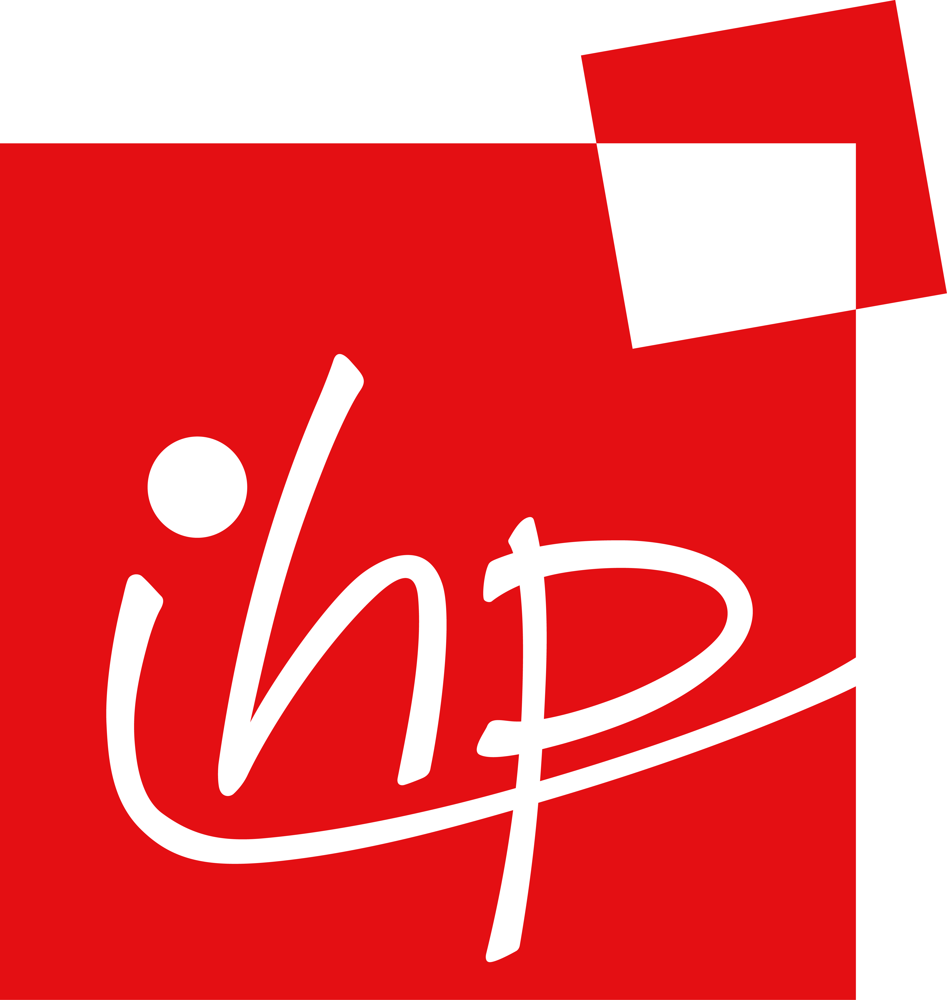

..  Copyright (c)  K. Mertens <mertens@ihp-microelectronics.com>

    Licensed under the Apache License, Version 2.0 (the "License");
    you may not use this file except in compliance with the License.
    You may obtain a copy of the License at

        http://www.apache.org/licenses/LICENSE-2.0

    Unless required by applicable law or agreed to in writing, software
    distributed under the License is distributed on an "AS IS" BASIS,
    WITHOUT WARRANTIES OR CONDITIONS OF ANY KIND, either express or implied.
    See the License for the specific language governing permissions and
    limitations under the License.

**********************************************************
Welcome to IHP 130nm BiCMOS Open Source PDK Documentation!
**********************************************************

.. include:: common.inc

.. toctree::
    :hidden:
    
    contents
    install
    process_specs/process_specs
    layout_rules/rules_man
    analog
    digital
    finishing
    verification
    contrib
    references

.. warning::
    This documentation is currently a **work in progress**.

SG13G2 Process Node
===================

SG13G2 is a high performance BiCMOS technology with a 0.13 μm CMOS process. It contains bipolar
devices based on SiGe:C npn-HBT's with up to 350 GHz transient frequency ($f_T$) and 450 GHz oscillation
frequency ($f_{max}$). This process provides 2 gate oxides: A thin gate oxide for the 1.2 V digital logic and a thick
oxide for a 3.3 V supply voltage. For both modules NMOS, PMOS and isolated NMOS transistors are
offered. Further passive components like poly silicon resistors and MIM capacitors are available. The
backend option offers 5 thin metal layers, two thick metal layers (2 and 3 μm thick) and a MIM layer.

Current Status -- |current-status|
==================================

.. current_status_text

.. warning::
    IHP Open Source PDK are currently treating the current content as an **experimental preview** / **alpha release**.

While the SG13G2 process node and the PDK from which this open source release was derived have been 
used to create many designs that have been successfully manufactured in significant quantities, 
the open source PDK is not intended to be used for production at this moment.

The PDK will be tagged with a production version when ready to do production design.

License
=======

The IHP Open Source PDK is released under the `Apache 2.0 license <LICENSE>`_.

The copyright details are::

    Copyright 2024 IHP PDK Authors

    Licensed under the Apache License, Version 2.0 (the "License");
    you may not use this file except in compliance with the License.
    You may obtain a copy of the License at

       https://www.apache.org/licenses/LICENSE-2.0

    Unless required by applicable law or agreed to in writing, software
    distributed under the License is distributed on an "AS IS" BASIS,
    WITHOUT WARRANTIES OR CONDITIONS OF ANY KIND, either express or implied.
    See the License for the specific language governing permissions and
    limitations under the License.
