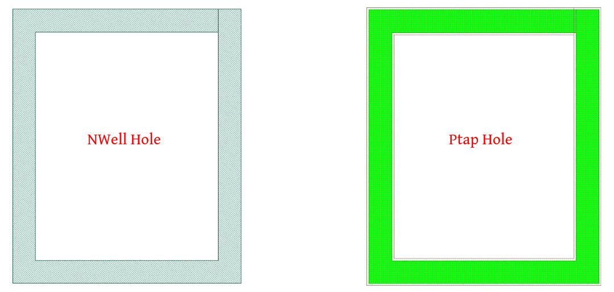

General-LVS
===========

Purpose
-------

This document describes layout devices for IHPs SG13G2 SiGe BiCMOS technology.

Abbreviations
-------------

Please refer to the :ref:`list_of_abbreviations` in the layout rules section for further details.

Derived Layers
--------------

.. note::
    Various rule definitions require derived layers instead of the original layers. The generation rules for the derived layers are described below.

.. csv-table:: Derived Layers
    :file: tables/derived_layers.csv
    :header-rows: 1
    :stub-columns: 1
    :widths: auto

The following figure illustrates the NWell_holes/Ptap_holes layers mentioned in the preceding table.

.. rst-class:: center

    Figure 1.3.1 Nwell-Holes derived layer 

.. tip::
    Refer to the `layout layers` section for information about drawing layer colors.

Glossary of Terms
-----------------

The following table provides definitions for terms that will be used in the upcoming sections:

.. csv-table:: Glossary of Terms
    :file: tables/terms_definitions.csv
    :header-rows: 1
    :stub-columns: 1
    :widths: auto
