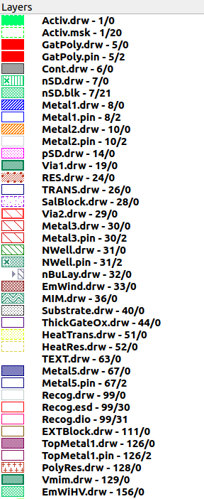
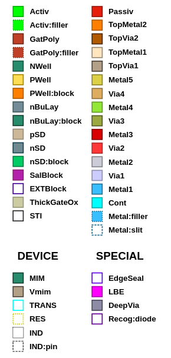

Layers
======

Layer Table
-----------

Please refer to :ref:`layer_table` for more information about available layers in SG13G2 SiGe BiCMOS technology.

.. _layers_key:

Layout Layers
-------------

.. tip::
    The illustration below is a helpful guide to understanding the layering system used in layout design. Each layer is assigned a unique color, making it visually clear and easier to visualize LVS devices.

.. rst-class:: center

    Figure 2.2.1 Layer Color Coding Reference for KLayout

.. rst-class:: center

    Figure 2.2.2 Layer Color Coding Reference for Layout (Original)
