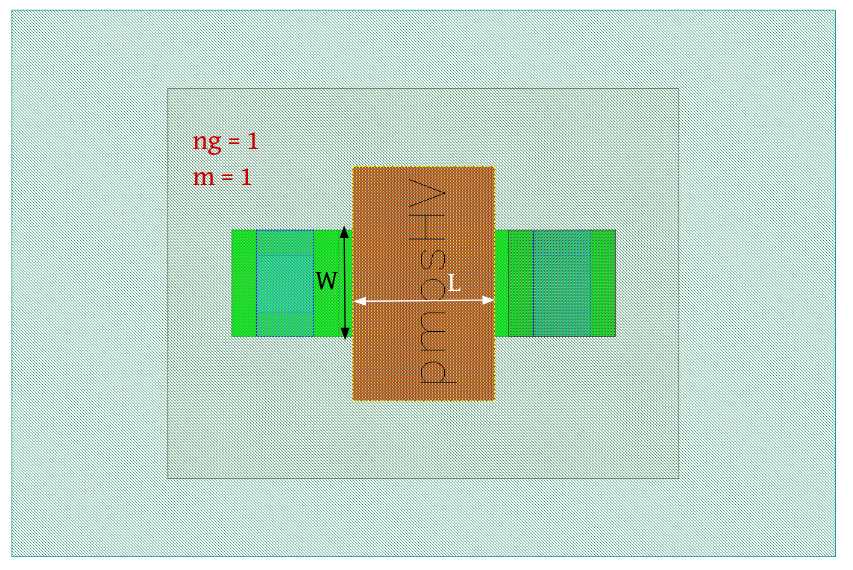

MOSFET-Devices
==============

nmos
----

**Device Information**

.. list-table:: n-Channel Enhancement MOS Transistor (LV) Specifications
   :header-rows: 1
   :stub-columns: 1

   * - Property
     - Value
   * - Description
     - n-channel enhancement MOS transistor - Low Voltage (LV)
   * - Device Recognition
     - Activ + GatPoly + HeatTrans
   * - Model Name
     - sg13_lv_nmos
   * - Layout Cell Name
     - sg13g2_pr - nmos
   * - Parameters
     - w, l, ng, m
   * - Additional Notes
     - Can be placed in nWell/nBuLay box for isolated nmosi device.

**Parameters Information**

.. list-table:: Xschem and LVS views Compatibility for nMOS Transistor Parameters
   :header-rows: 1
   :stub-columns: 1

   * - Parameter
     - Description
     - Xschem-View
     - LVS-View
   * - w
     - Transistor width
     - ✅
     - ✅
   * - l
     - Transistor channel length
     - ✅
     - ✅
   * - m
     - Number of transistors (multiplicity)
     - ✅
     - ✅
   * - ng
     - Number of transistor gates
     - ✅
     - ✅

**Layout Information** (Refer to :ref:`layout layers`)

.. image:: images/nmos_layout.png
    :width: 700
    :align: center
    :alt: nmos device - layout

.. rst-class:: center

    Figure 4.1.1 Layout for n-Channel Enhancement MOS Transistor (LV)

nmosHV
------

**Device Information**

.. list-table:: n-Channel Enhancement MOS Transistor (HV) Specifications
   :header-rows: 1
   :stub-columns: 1

   * - Property
     - Value
   * - Description
     - n-channel enhancement MOS transistor with max SD voltage of 3.3V - High Voltage (HV)
   * - Device Recognition
     - Activ + GatPoly + HeatTrans + ThickGateOx
   * - Model Name
     - sg13_hv_nmos
   * - Layout Cell Name
     - sg13g2_pr - nmosHV
   * - Parameters
     - w, l, ng, m
   * - Additional Notes
     - Can be placed in nWell/nBuLay box for isolated nmosi device.

**Parameters Information**

.. list-table:: Xschem and LVS views Compatibility for nMOSHV Transistor Parameters
   :header-rows: 1
   :stub-columns: 1

   * - Parameter
     - Description
     - Xschem-View
     - LVS-View
   * - w
     - Transistor width
     - ✅
     - ✅
   * - l
     - Transistor channel length
     - ✅
     - ✅
   * - m
     - Number of transistors (multiplicity)
     - ✅
     - ✅
   * - ng
     - Number of transistor gates
     - ✅
     - ✅

**Layout Information** (Refer to :ref:`layout layers`)

.. image:: images/nmoshv_layout.png
    :width: 700
    :align: center
    :alt: nmos HV device - layout

.. rst-class:: center

    Figure 4.1.2 Layout for n-Channel Enhancement MOS Transistor (HV)

pmos
----

**Device Information**

.. list-table:: p-Channel Enhancement MOS Transistor (LV) Specifications
   :header-rows: 1
   :stub-columns: 1

   * - Property
     - Value
   * - Description
     - p-channel enhancement MOS transistor - Low Voltage (LV)
   * - Device Recognition
     - Activ + GatPoly + pSD + Nwell + HeatTrans + Substrate
   * - Model Name
     - sg13_lv_pmos
   * - Layout Cell Name
     - sg13g2_pr - pmos
   * - Parameters
     - w, l, ng, m

**Parameters Information**

.. list-table:: Xschem and LVS views Compatibility for pMOS Transistor Parameters
   :header-rows: 1
   :stub-columns: 1

   * - Parameter
     - Description
     - Xschem-View
     - LVS-View
   * - w
     - Transistor width
     - ✅
     - ✅
   * - l
     - Transistor channel length
     - ✅
     - ✅
   * - m
     - Number of transistors (multiplicity)
     - ✅
     - ✅
   * - ng
     - Number of transistor gates
     - ✅
     - ✅

**Layout Information** (Refer to :ref:`layout layers`)

.. image:: images/pmos_layout.png
    :width: 700
    :align: center
    :alt: pmos device - layout

.. rst-class:: center

    Figure 4.1.3 Layout for p-Channel Enhancement MOS Transistor (LV)

pmosHV
------

**Device Information**

.. list-table:: p-Channel Enhancement MOS Transistor (HV) Specifications
   :header-rows: 1
   :stub-columns: 1

   * - Property
     - Value
   * - Description
     - p-channel enhancement MOS transistor with max SD voltage of 3.3V - High Voltage (HV)
   * - Device Recognition
     - Activ + GatPoly + pSD + Nwell + HeatTrans + ThickGateOx  + Substrate
   * - Model Name
     - sg13_hv_pmos
   * - Layout Cell Name
     - sg13g2_pr - pmosHV
   * - Parameters
     - w, l, ng, m

**Parameters Information**

.. list-table:: Xschem and LVS views Compatibility for pMOSHV Transistor Parameters
   :header-rows: 1
   :stub-columns: 1

   * - Parameter
     - Description
     - Xschem-View
     - LVS-View
   * - w
     - Transistor width
     - ✅
     - ✅
   * - l
     - Transistor channel length
     - ✅
     - ✅
   * - m
     - Number of transistors (multiplicity)
     - ✅
     - ✅
   * - ng
     - Number of transistor gates
     - ✅
     - ✅

**Layout Information** (Refer to :ref:`layout layers`)

.. rst-class:: center

    Figure 4.1.4 Layout for p-Channel Enhancement MOS Transistor (HV)
