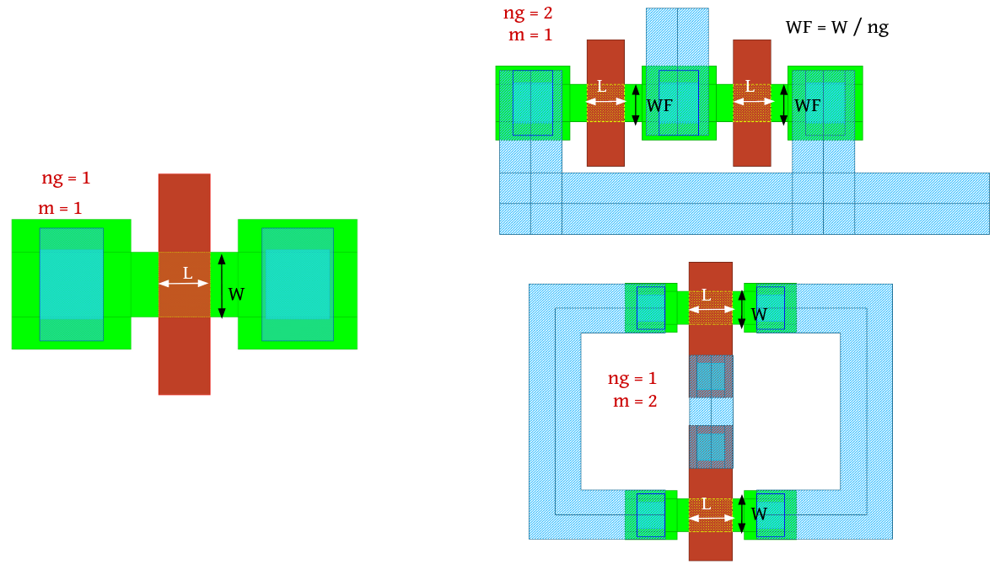
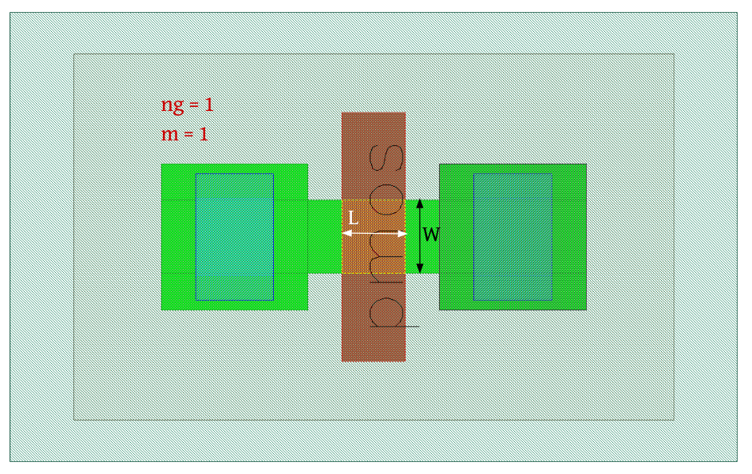

MOSFET-Devices
==============

nmos
----

**Device Information**

.. list-table:: nMOS-LV Transistor Specifications
   :header-rows: 1
   :stub-columns: 1

   * - Property
     - Value
   * - Description
     - n-channel enhancement MOS transistor - Low Voltage (LV)
   * - Device Recognition
     - Activ, GatPoly, HeatTrans
   * - Model Name
     - sg13_lv_nmos
   * - Layout Cell Name
     - sg13g2_pr - nmos
   * - Parameters
     - w, l, ng, m
   * - Netlist Syntax
     - `MN1 D G S B sg13_lv_nmos w=150.00n l=130.00n m=1 ng=1`
   * - Additional Notes
     - Can be placed in nWell/nBuLay box for isolated nmosi device.

**Parameters Information**

.. list-table:: Schematic and LVS views Compatibility for nMOS Transistor Parameters
   :header-rows: 1
   :stub-columns: 1

   * - Parameter
     - Description
     - Schematic-View
     - LVS-View
     - LVS-Comparison
   * - w
     - Transistor width
     - ✅
     - ✅
     - ✅
   * - l
     - Transistor channel length
     - ✅
     - ✅
     - ✅
   * - m
     - Number of transistors (multiplicity)
     - ✅
     - ❌
     - ❌
   * - ng
     - Number of gates
     - ✅
     - ❌
     - ❌

.. tip::
    Both the parameters 'm' and 'ng' are implicitly calculated within the 'w' parameter. Here, the 'w' parameter denotes the total width.

**Layout Information** (Refer to :ref:`layout layers`)

.. rst-class:: center

    Figure 4.1.1 Layout for nMOS-LV transistor

nmosHV
------

**Device Information**

.. list-table:: nMOS-HV Transistor Specifications
   :header-rows: 1
   :stub-columns: 1

   * - Property
     - Value
   * - Description
     - n-channel enhancement MOS transistor with max SD voltage of 3.3V - High Voltage (HV)
   * - Device Recognition
     - Activ, GatPoly, HeatTrans, ThickGateOx
   * - Model Name
     - sg13_hv_nmos
   * - Layout Cell Name
     - sg13g2_pr - nmosHV
   * - Parameters
     - w, l, ng, m
   * - Netlist Syntax
     - `MN1 D G S B sg13_hv_nmos w=0.6u l=0.45u ng=1 m=1`
   * - Additional Notes
     - Can be placed in nWell/nBuLay box for isolated nmosi device.

**Parameters Information**

.. list-table:: Schematic and LVS views Compatibility for nMOSHV Transistor Parameters
   :header-rows: 1
   :stub-columns: 1

   * - Parameter
     - Description
     - Schematic-View
     - LVS-View
     - LVS-Comparison
   * - w
     - Transistor width
     - ✅
     - ✅
     - ✅
   * - l
     - Transistor channel length
     - ✅
     - ✅
     - ✅
   * - m
     - Number of transistors (multiplicity)
     - ✅
     - ❌
     - ❌
   * - ng
     - Number of gates
     - ✅
     - ❌
     - ❌

.. tip::
    Both the parameters 'm' and 'ng' are implicitly calculated within the 'w' parameter. Here, the 'w' parameter denotes the total width.

**Layout Information** (Refer to :ref:`layout layers`)

.. image:: images/nmoshv_layout.png
    :width: 500
    :align: center
    :alt: nmos HV device - layout

.. rst-class:: center

    Figure 4.1.2 Layout for nMOS-HV transistor

pmos
----

**Device Information**

.. list-table:: pMOS-LV Transistor Specifications
   :header-rows: 1
   :stub-columns: 1

   * - Property
     - Value
   * - Description
     - p-channel enhancement MOS transistor - Low Voltage (LV)
   * - Device Recognition
     - Activ, GatPoly, pSD, Nwell, HeatTrans, Substrate
   * - Model Name
     - sg13_lv_pmos
   * - Layout Cell Name
     - sg13g2_pr - pmos
   * - Parameters
     - w, l, ng, m
   * - Netlist Syntax
     - `MP1 D G S B sg13_lv_pmos w=150.00n l=130.00n ng=1 m=1`

**Parameters Information**

.. list-table:: Schematic and LVS views Compatibility for pMOS Transistor Parameters
   :header-rows: 1
   :stub-columns: 1

   * - Parameter
     - Description
     - Schematic-View
     - LVS-View
     - LVS-Comparison
   * - w
     - Transistor width
     - ✅
     - ✅
     - ✅
   * - l
     - Transistor channel length
     - ✅
     - ✅
     - ✅
   * - m
     - Number of transistors (multiplicity)
     - ✅
     - ❌
     - ❌
   * - ng
     - Number of gates
     - ✅
     - ❌
     - ❌

.. tip::
    Both the parameters 'm' and 'ng' are implicitly calculated within the 'w' parameter. Here, the 'w' parameter denotes the total width.

**Layout Information** (Refer to :ref:`layout layers`)

.. rst-class:: center

    Figure 4.1.3 Layout for pMOS-LV transistor

pmosHV
------

**Device Information**

.. list-table:: pMOS-HV Transistor Specifications
   :header-rows: 1
   :stub-columns: 1

   * - Property
     - Value
   * - Description
     - p-channel enhancement MOS transistor with max SD voltage of 3.3V - High Voltage (HV)
   * - Device Recognition
     - Activ, GatPoly, pSD, Nwell, HeatTrans, ThickGateOx, Substrate
   * - Model Name
     - sg13_hv_pmos
   * - Layout Cell Name
     - sg13g2_pr - pmosHV
   * - Parameters
     - w, l, ng, m
   * - Netlist Syntax
     - `MP1 D G S B sg13_hv_pmos w=0.3u l=0.4u ng=1 m=1`

**Parameters Information**

.. list-table:: Schematic and LVS views Compatibility for pMOSHV Transistor Parameters
   :header-rows: 1
   :stub-columns: 1

   * - Parameter
     - Description
     - Schematic-View
     - LVS-View
     - LVS-Comparison
   * - w
     - Transistor width
     - ✅
     - ✅
     - ✅
   * - l
     - Transistor channel length
     - ✅
     - ✅
     - ✅
   * - m
     - Number of transistors (multiplicity)
     - ✅
     - ❌
     - ❌
   * - ng
     - Number of gates
     - ✅
     - ❌
     - ❌

.. tip::
    Both the parameters 'm' and 'ng' are implicitly calculated within the 'w' parameter. Here, the 'w' parameter denotes the total width.

**Layout Information** (Refer to :ref:`layout layers`)

.. image:: images/pmoshv_layout.png
    :width: 500
    :align: center
    :alt: pmos HV device - layout

.. rst-class:: center

    Figure 4.1.4 Layout for pMOS-HV transistor
