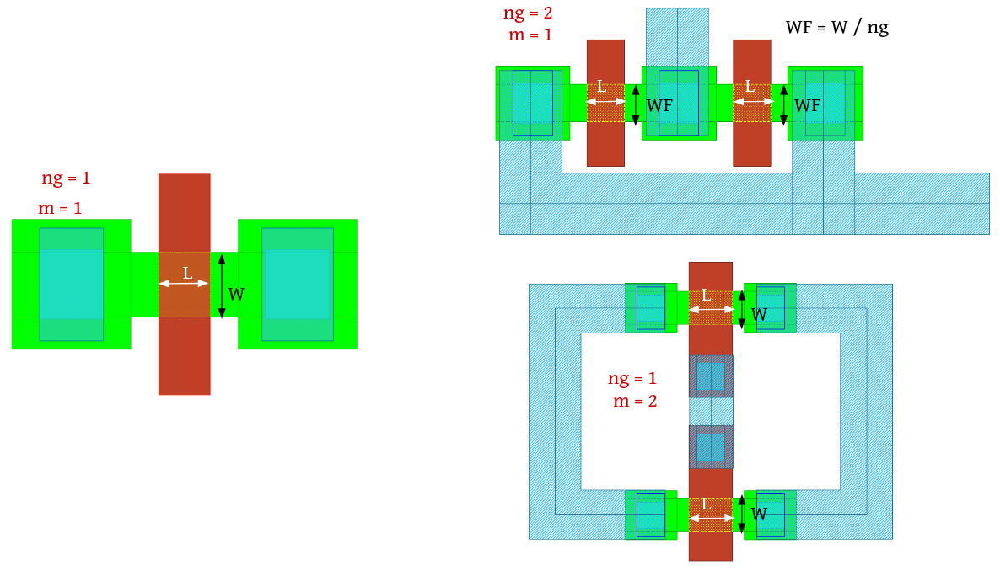
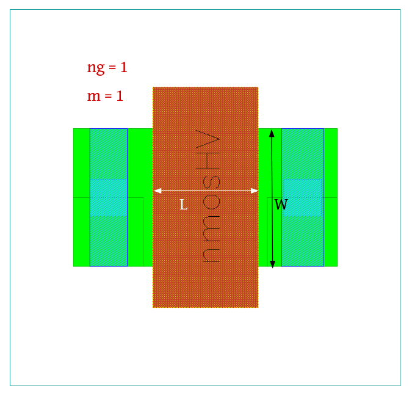
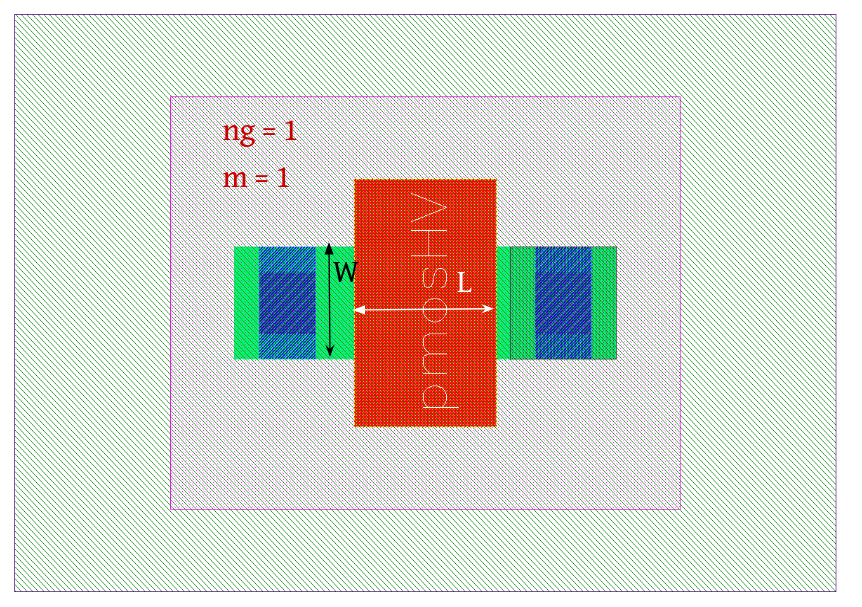

4.2 MOSFET-Devices
==================

4.2.1 nmos
----------

+---------------------+-----------------------------------------------------------------+
|Property             |Value                                                            |
+---------------------+-----------------------------------------------------------------+
| Description         | n-channel enhancement MOS transistor - Low Voltage (LV)         |
+---------------------+-----------------------------------------------------------------+
| Device Recognition  | Activ + GatPoly + HeatTrans                                     |
+---------------------+-----------------------------------------------------------------+
| Model Name          | sg13_lv_nmos                                                    |
+---------------------+-----------------------------------------------------------------+
| Layout Cell Name    | sg13g2_pr - nmos                                                |
+---------------------+-----------------------------------------------------------------+
| Netlist Syntax      | `MN0 D G S B sg13_lv_nmos m=1 w=150.00n l=130.00n ng=1`         |
+---------------------+-----------------------------------------------------------------+
| Measured Parameters | w, l, number of gates (ng), m                                   |
+---------------------+-----------------------------------------------------------------+
| Additional Notes    | - Can be placed in nWell/nBuLay box for isolated nmosi device.  |
+---------------------+-----------------------------------------------------------------+

    Figure 4.2.1 Layout for nmos device

4.2.2 nmosHV
------------

+---------------------+--------------------------------------------------------------------------------------+
|Property             |Value                                                                                 |
+---------------------+--------------------------------------------------------------------------------------+
| Description         | n-channel enhancement MOS transistor with max SD voltage of 3.3V - High Voltage (HV) |
+---------------------+--------------------------------------------------------------------------------------+
| Device Recognition  | Activ + GatPoly + HeatTrans + ThickGateOx                                            |
+---------------------+--------------------------------------------------------------------------------------+
| Model Name          | sg13_hv_nmos                                                                         |
+---------------------+--------------------------------------------------------------------------------------+
| Layout Cell Name    | sg13g2_pr - nmosHV                                                                   |
+---------------------+--------------------------------------------------------------------------------------+
| Netlist Syntax      | `MN1 D G S B sg13_hv_nmos m=1 w=600.0n l=330.00n ng=1`                               |
+---------------------+--------------------------------------------------------------------------------------+
| Measured Parameters | w, l, number of gates (ng), m                                                        |
+---------------------+--------------------------------------------------------------------------------------+
| Additional Notes    | - Can be placed in nWell/nBuLay box for isolated nmosi device.                       |
+---------------------+--------------------------------------------------------------------------------------+

    Figure 4.2.2 Layout for nmos HV device

4.2.3 pmos
----------

+---------------------+-----------------------------------------------------------------+
|Property             |Value                                                            |
+---------------------+-----------------------------------------------------------------+
| Description         | p-channel enhancement MOS transistor - Low Voltage (LV)         |
+---------------------+-----------------------------------------------------------------+
| Device Recognition  | Activ + GatPoly + pSD + Nwell + HeatTrans + Substrate           |
+---------------------+-----------------------------------------------------------------+
| Model Name          | sg13_lv_pmos                                                    |
+---------------------+-----------------------------------------------------------------+
| Layout Cell Name    | sg13g2_pr - pmos                                                |
+---------------------+-----------------------------------------------------------------+
| Netlist Syntax      | `MP0 D G S B sg13_lv_pmos m=1 w=150.00n l=130.00n ng=1`         |
+---------------------+-----------------------------------------------------------------+
| Measured Parameters | w, l, number of gates (ng), m                                   |
+---------------------+-----------------------------------------------------------------+

.. figure:: images/pmos_layout.png
    :width: 850
    :align: center
    :alt: pmos device - layout

    Figure 4.2.3 Layout for pmos device

4.2.4 pmosHV
------------

+---------------------+--------------------------------------------------------------------------------------+
|Property             |Value                                                                                 |
+---------------------+--------------------------------------------------------------------------------------+
| Description         | p-channel enhancement MOS transistor with max SD voltage of 3.3V - High Voltage (HV) |
+---------------------+--------------------------------------------------------------------------------------+
| Device Recognition  | Activ + GatPoly + pSD + Nwell + HeatTrans + ThickGateOx  + Substrate                 |
+---------------------+--------------------------------------------------------------------------------------+
| Model Name          | sg13_hv_pmos                                                                         |
+---------------------+--------------------------------------------------------------------------------------+
| Layout Cell Name    | sg13g2_pr - nmosHV                                                                   |
+---------------------+--------------------------------------------------------------------------------------+
| Netlist Syntax      | `MP1 D G S B sg13_hv_pmos m=1 w=300.0n l=330.00n ng=1`                               |
+---------------------+--------------------------------------------------------------------------------------+
| Measured Parameters | w, l, number of gates (ng), m                                                        |
+---------------------+--------------------------------------------------------------------------------------+

    Figure 4.2.4 Layout for pmos HV device
