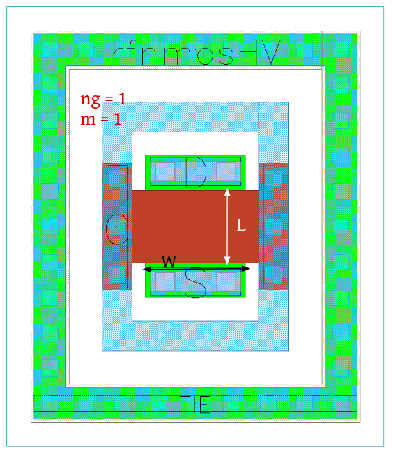
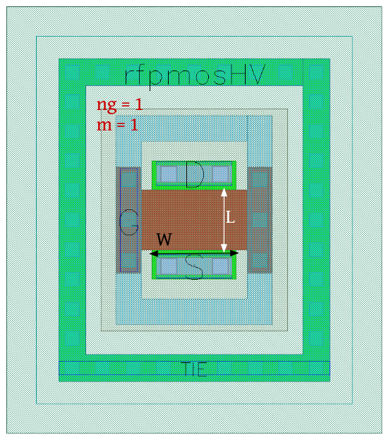

RF-MOSFET-Devices
=================

rfnmos
------

**Device Information**

.. list-table:: RF nMOS-LV Transistor Specifications
   :header-rows: 1
   :stub-columns: 1

   * - Property
     - Value
   * - Description
     - nMOS device with ptap surrounding and special RF model.
   * - Device Recognition
     - Activ, GatPoly, psD (For ptap)
   * - Model Name
     - rfnmos
   * - Layout Cell Name
     - sg13g2_pr - rfnmos
   * - Parameters
     - w, l, ng, m
   * - Additional Notes
     - For RF purposes, you should use l = [0.13:1.0]um and w = [1:6]um (per single gate).

**Parameters Information**

.. list-table:: Xschem and LVS views Compatibility for RF nMOS Transistor Parameters
   :header-rows: 1
   :stub-columns: 1

   * - Parameter
     - Description
     - Xschem-View
     - LVS-View
   * - w
     - Transistor width
     - ✅
     - ✅
   * - l
     - Transistor channel length
     - ✅
     - ✅
   * - m
     - Number of transistors (multiplicity)
     - ✅
     - ✅
   * - ng
     - Number of transistor gates
     - ✅
     - ✅

**Layout Information** (Refer to :ref:`layout layers`)

.. image:: images/rfnmos_layout.png
    :width: 700
    :align: center
    :alt: RF nMOS Transistor - layout

.. rst-class:: center

    Figure 4.2.1 Layout for RF nMOS-LV transistor

rfnmosHV
--------

**Device Information**

.. list-table:: RF nMOS-HV Transistor Specifications
   :header-rows: 1
   :stub-columns: 1

   * - Property
     - Value
   * - Description
     - nmosHV device with ptap surrounding and special RF model.
   * - Device Recognition
     - Activ, GatPoly, ThickGateOx, psD (For ptap)
   * - Model Name
     - rfnmosHV
   * - Layout Cell Name
     - sg13g2_pr - rfnmosHV
   * - Parameters
     - w, l, ng, m
   * - Additional Notes
     - For RF purposes you should use l = [0.45:1.0]um and w = [1:6]um (per single gate).

**Parameters Information**

.. list-table:: Xschem and LVS views Compatibility for RF nMOS HV Transistor Parameters
   :header-rows: 1
   :stub-columns: 1

   * - Parameter
     - Description
     - Xschem-View
     - LVS-View
   * - w
     - Transistor width
     - ✅
     - ✅
   * - l
     - Transistor channel length
     - ✅
     - ✅
   * - m
     - Number of transistors (multiplicity)
     - ✅
     - ✅
   * - ng
     - Number of transistor gates
     - ✅
     - ✅

**Layout Information** (Refer to :ref:`layout layers`)

.. rst-class:: center

    Figure 4.2.2 Layout for RF nMOS-HV Transistor

rfpmos
------

**Device Information**

.. list-table:: RF pMOS-LV Transistor Specifications
   :header-rows: 1
   :stub-columns: 1

   * - Property
     - Value
   * - Description
     - pMOS device with ntap surrounding and special RF model.
   * - Device Recognition
     - Activ, GatPoly, pSD, Nwell 
   * - Model Name
     - rfpmos
   * - Layout Cell Name
     - sg13g2_pr - rfpmos
   * - Parameters
     - w, l, ng, m
   * - Additional Notes
     - For RF purposes you should use l = [0.13:1.0]um and w = [1:6]um (per single gate).

**Parameters Information**

.. list-table:: Xschem and LVS views Compatibility for RF pMOS Transistor Parameters
   :header-rows: 1
   :stub-columns: 1

   * - Parameter
     - Description
     - Xschem-View
     - LVS-View
   * - w
     - Transistor width
     - ✅
     - ✅
   * - l
     - Transistor channel length
     - ✅
     - ✅
   * - m
     - Number of transistors (multiplicity)
     - ✅
     - ✅
   * - ng
     - Number of transistor gates
     - ✅
     - ✅

**Layout Information** (Refer to :ref:`layout layers`)

.. image:: images/rfpmos_layout.png
    :width: 700
    :align: center
    :alt: RF pMOS Transistor - layout

.. rst-class:: center

    Figure 4.2.3 Layout for RF pMOS-LV Transistor

rfpmosHV
--------

**Device Information**

.. list-table:: RF pMOS-HV Transistor Specifications
   :header-rows: 1
   :stub-columns: 1

   * - Property
     - Value
   * - Description
     - pmosHV device with ntap surrounding and special RF model.
   * - Device Recognition
     - Activ, GatPoly, pSD, Nwell, ThickGateOx
   * - Model Name
     - rfpmosHV
   * - Layout Cell Name
     - sg13g2_pr - rfpmosHV
   * - Parameters
     - w, l, ng, m
   * - Additional Notes
     - For RF purposes you should use l = [0.40:1.0]um and w = [1:6]um (per single gate).

**Parameters Information**

.. list-table:: Xschem and LVS views Compatibility for RF pMOS HV Transistor Parameters
   :header-rows: 1
   :stub-columns: 1

   * - Parameter
     - Description
     - Xschem-View
     - LVS-View
   * - w
     - Transistor width
     - ✅
     - ✅
   * - l
     - Transistor channel length
     - ✅
     - ✅
   * - m
     - Number of transistors (multiplicity)
     - ✅
     - ✅
   * - ng
     - Number of transistor gates
     - ✅
     - ✅

**Layout Information** (Refer to :ref:`layout layers`)

.. rst-class:: center

    Figure 4.2.4 Layout for RF pMOS-HV transistor
