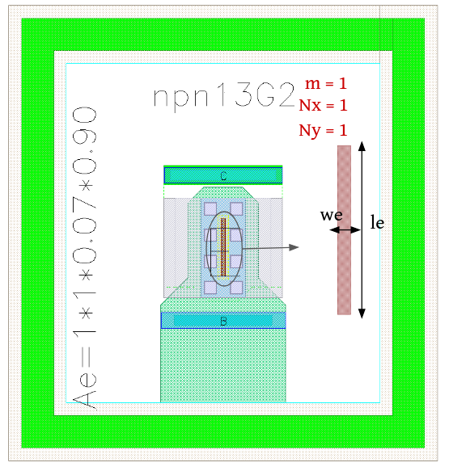
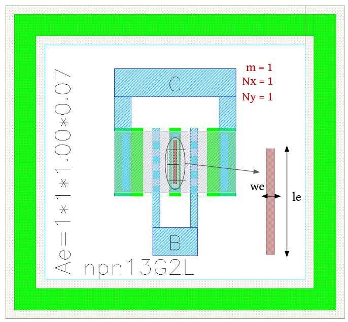
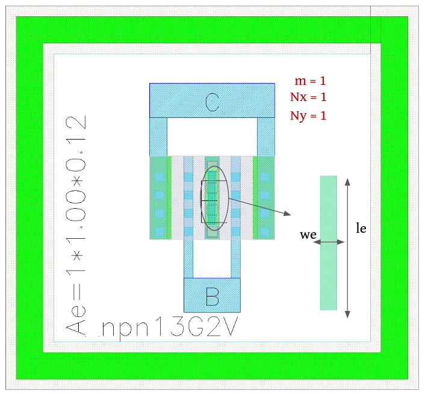

BJT-Devices
===========

npn13G2
-------

**Device Information**

.. list-table:: HBT NPN13G2 Bipolar Specifications
   :header-rows: 1
   :stub-columns: 1

   * - Property
     - Value
   * - Description
     - npn SiGe:C HBT high performance device, 300 GHz fT. Layout configuration BEC
   * - Device Recognition
     - Activ, nSD.blk, HeatTrans, TRANS, EmWind, ptab (pSD + Activ.mask)
   * - Model Name
     - npn13G2
   * - Layout Cell Name
     - sg13g2_pr - npn13G2
   * - Parameters
     - we, le, m, Nx, Ny

**Parameters Information**

.. list-table:: Schematic and LVS views Compatibility for npn13G2 Parameters
   :header-rows: 1
   :stub-columns: 1

   * - Parameter
     - Description
     - Schematic-View
     - LVS-View
     - LVS-Comparison
   * - we
     - Emitter width (Fixed)
     - ❌
     - ✅
     - ❌
   * - le
     - Emitter length (Fixed)
     - ❌
     - ✅
     - ❌
   * - m
     - Number of BJTs (multiplicity)
     - ❌
     - ✅
     - ✅
   * - Nx
     - Number of BJTs in x-axis
     - ✅
     - ✅
     - ❌
   * - Ny
     - Number of BJTs in y-axis
     - ❌
     - ✅
     - ❌

**Layout Information** (Refer to :ref:`layout layers`)

.. rst-class:: center

    Figure 4.3.1 Layout for NPN13G2 bipolar transistor

npn13G2L
--------

**Device Information**

.. list-table:: HBT NPN13G2L Bipolar Transistor Specifications
   :header-rows: 1
   :stub-columns: 1

   * - Property
     - Value
   * - Description
     - npn SiGe:C scalable HBT high performance device, 280 GHz fT. Layout configuration BEC
   * - Device Recognition
     - Activ, HeatTrans, TRANS, EmWind, ptab (pSD + Activ.mask)
   * - Model Name
     - npn13G2l
   * - Layout Cell Name
     - sg13g2_pr - npn13G2L
   * - Parameters
     - we, le, m, Nx, Ny

**Parameters Information**

.. list-table:: Schematic and LVS views Compatibility for npn13G2L Parameters
   :header-rows: 1
   :stub-columns: 1

   * - Parameter
     - Description
     - Schematic-View
     - LVS-View
     - LVS-Comparison
   * - we
     - Emitter width (Fixed)
     - ❌
     - ✅
     - ❌
   * - le
     - Emitter length
     - ❌
     - ✅
     - ✅
   * - m
     - Number of BJTs (multiplicity)
     - ❌
     - ✅
     - ✅
   * - Nx
     - Number of BJTs in x-axis
     - ✅
     - ✅
     - ❌
   * - Ny
     - Number of BJTs in y-axis
     - ❌
     - ✅
     - ❌

**Layout Information** (Refer to :ref:`layout layers`)

.. rst-class:: center

    Figure 4.3.2 Layout for NPN13G2L bipolar transistor

npn13G2V
--------

.. list-table:: HBT NPN13G2V Bipolar Transistor Specifications
   :header-rows: 1
   :stub-columns: 1

   * - Property
     - Value
   * - Description
     - npn SiGe:C scalable HBT high voltage device, 90 GHz fT. Layout configuration BEC
   * - Device Recognition
     - Activ, HeatTrans, TRANS, EmWiHV, ptab (pSD + Activ.mask)
   * - Model Name
     - npn13G2v
   * - Layout Cell Name
     - sg13g2_pr - npn13G2V
   * - Parameters
     - we, le, m, Nx, Ny

**Parameters Information**

.. list-table:: Schematic and LVS views Compatibility for npn13G2V Parameters
   :header-rows: 1
   :stub-columns: 1

   * - Parameter
     - Description
     - Schematic-View
     - LVS-View
     - LVS-Comparison
   * - we
     - Emitter width (Fixed)
     - ❌
     - ✅
     - ❌
   * - le
     - Emitter length
     - ❌
     - ✅
     - ✅
   * - m
     - Number of BJTs (multiplicity)
     - ❌
     - ✅
     - ✅
   * - Nx
     - Number of BJTs in x-axis
     - ✅
     - ✅
     - ❌
   * - Ny
     - Number of BJTs in y-axis
     - ❌
     - ✅
     - ❌

**Layout Information** (Refer to :ref:`layout layers`)

.. rst-class:: center

    Figure 4.3.3 Layout for NPN13G2V bipolar transistor

pnpMPA
------

**Device Information**

.. list-table:: HBT PNP Bipolar Transistor Specifications
   :header-rows: 1
   :stub-columns: 1

   * - Property
     - Value
   * - Description
     - HBT pnp used for BandGap Reference (BGR) circuit
   * - Device Recognition
     - Activ, NWell, nBuLay, pSD
   * - Model Name
     - pnpMPA
   * - Layout Cell Name
     - sg13g2_pr - pnpMPA
   * - Parameters
     - l, w, a, p, m

**Parameters Information**

.. list-table:: Schematic and LVS views Compatibility for pnpMPA Parameters
   :header-rows: 1
   :stub-columns: 1

   * - Parameter
     - Description
     - Schematic-View
     - LVS-View
     - LVS-Comparison
   * - W
     - Emitter width
     - ✅
     - ✅
     - ❌
   * - L
     - Emitter length 
     - ✅
     - ✅
     - ❌
   * - A
     - Emitter area 
     - ❌
     - ✅
     - ✅
   * - P
     - Emitter perimeter
     - ❌
     - ✅
     - ✅
   * - m
     - Number of BJTs (multiplicity)
     - ❌
     - ✅
     - ✅

**Layout Information** (Refer to :ref:`layout layers`)

.. rst-class:: center

    Figure 4.3.4 Layout for pnpMPA bipolar transistor
