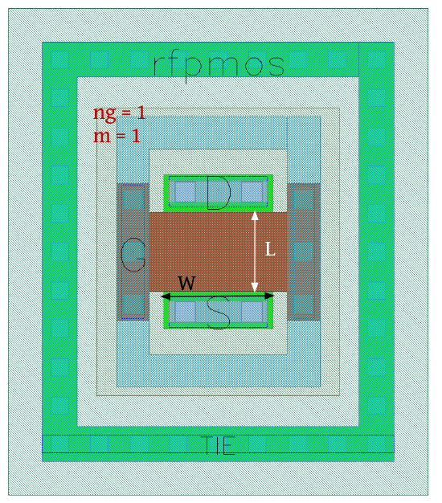

RF-MOSFET-Devices
=================

rfnmos
------

+---------------------+--------------------------------------------------------------------------------------+
|Property             |Value                                                                                 |
+---------------------+--------------------------------------------------------------------------------------+
| Description         | nmos device with ptap surrounding and special RF model.                              |
+---------------------+--------------------------------------------------------------------------------------+
| Device Recognition  | Activ + GatPoly + psD (For ptap-Gaurd-Ring)                                          |
+---------------------+--------------------------------------------------------------------------------------+
| Model Name          | rfnmos                                                                               |
+---------------------+--------------------------------------------------------------------------------------+
| Layout Cell Name    | sg13g2_pr - rfnmos                                                                   |
+---------------------+--------------------------------------------------------------------------------------+
| Netlist Syntax      | `MN2 D G S TIE rfnmos m=1 w=1u l=720.00n ng=1`                                       |
+---------------------+--------------------------------------------------------------------------------------+
| Measured Parameters | w, l, number of gates (ng), m                                                        |
+---------------------+--------------------------------------------------------------------------------------+
| Additional Notes    | - For RF purposes, you should use l = [0.13:1.0]um and w = [1:6]um (per single gate) |
+---------------------+--------------------------------------------------------------------------------------+

.. figure:: images/rfnmos_layout.png
    :width: 850
    :align: center
    :alt: RF nmos device - layout

    Figure 4.3.1 Layout for RF nmos device

rfnmosHV
--------

+---------------------+--------------------------------------------------------------------------------------+
|Property             |Value                                                                                 |
+---------------------+--------------------------------------------------------------------------------------+
| Description         | nmosHV device with ptap surrounding and special RF model.                            |
+---------------------+--------------------------------------------------------------------------------------+
| Device Recognition  | Activ + GatPoly + ThickGateOx + psD (For ptap-Gaurd-Ring)                            |
+---------------------+--------------------------------------------------------------------------------------+
| Model Name          | rfnmosHV                                                                             |
+---------------------+--------------------------------------------------------------------------------------+
| Layout Cell Name    | sg13g2_pr - rfnmosHV                                                                 |
+---------------------+--------------------------------------------------------------------------------------+
| Netlist Syntax      | `MN3 D G S TIE rfnmosHV m=1 w=1u l=720.00n ng=1`                                     |
+---------------------+--------------------------------------------------------------------------------------+
| Measured Parameters | w, l, number of gates (ng), m                                                        |
+---------------------+--------------------------------------------------------------------------------------+
| Additional Notes    | - For RF purposes you should use l = [0.45:1.0]um and w = [1:6]um (per single gate)  |
+---------------------+--------------------------------------------------------------------------------------+

.. figure:: images/rfnmoshv_layout.png
    :width: 850
    :align: center
    :alt: RF nmos HV device - layout

    Figure 4.3.2 Layout for RF nmos HV device

rfpmos
------

+---------------------+--------------------------------------------------------------------------------------+
|Property             |Value                                                                                 |
+---------------------+--------------------------------------------------------------------------------------+
| Description         | pmos device with ntap surrounding and special RF model.                              |
+---------------------+--------------------------------------------------------------------------------------+
| Device Recognition  | Activ + GatPoly + pSD + Nwell                                                        |
+---------------------+--------------------------------------------------------------------------------------+
| Model Name          | rfpmos                                                                               |
+---------------------+--------------------------------------------------------------------------------------+
| Layout Cell Name    | sg13g2_pr - rfpmos                                                                   |
+---------------------+--------------------------------------------------------------------------------------+
| Netlist Syntax      | `MP2 D G S TIE rfpmos m=1 w=1u l=720.00n ng=1`                                       |
+---------------------+--------------------------------------------------------------------------------------+
| Measured Parameters | w, l, number of gates (ng), m                                                        |
+---------------------+--------------------------------------------------------------------------------------+
| Additional Notes    | - For RF purposes you should use l = [0.13:1.0]um and w = [1:6]um (per single gate)  |
+---------------------+--------------------------------------------------------------------------------------+

    Figure 4.3.3 Layout for RF pmos device

rfpmosHV
--------

+---------------------+--------------------------------------------------------------------------------------+
|Property             |Value                                                                                 |
+---------------------+--------------------------------------------------------------------------------------+
| Description         | pmosHV device with ntap surrounding and special RF model.                            |
+---------------------+--------------------------------------------------------------------------------------+
| Device Recognition  | Activ + GatPoly + pSD + Nwell + ThickGateOx                                          |
+---------------------+--------------------------------------------------------------------------------------+
| Model Name          | rfpmosHV                                                                             |
+---------------------+--------------------------------------------------------------------------------------+
| Layout Cell Name    | sg13g2_pr - rfpmosHV                                                                 |
+---------------------+--------------------------------------------------------------------------------------+
| Netlist Syntax      | `MP3 D G S TIE rfpmosHV m=1 w=1u l=720.00n ng=1`                                     |
+---------------------+--------------------------------------------------------------------------------------+
| Measured Parameters | w, l, number of gates (ng), m                                                        |
+---------------------+--------------------------------------------------------------------------------------+
| Additional Notes    | - For RF purposes you should use l = [0.40:1.0]um and w = [1:6]um (per single gate)  |
+---------------------+--------------------------------------------------------------------------------------+

.. figure:: images/rfpmoshv_layout.png
    :width: 850
    :align: center
    :alt: RF pmos HV device - layout

    Figure 4.3.4 Layout for RF pmos HV device
