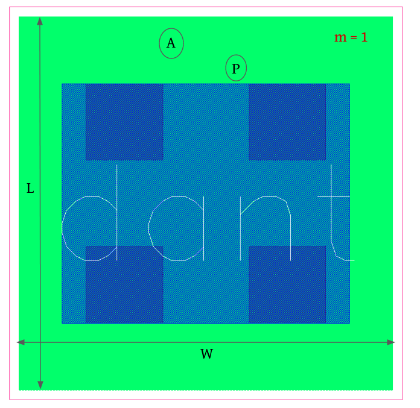
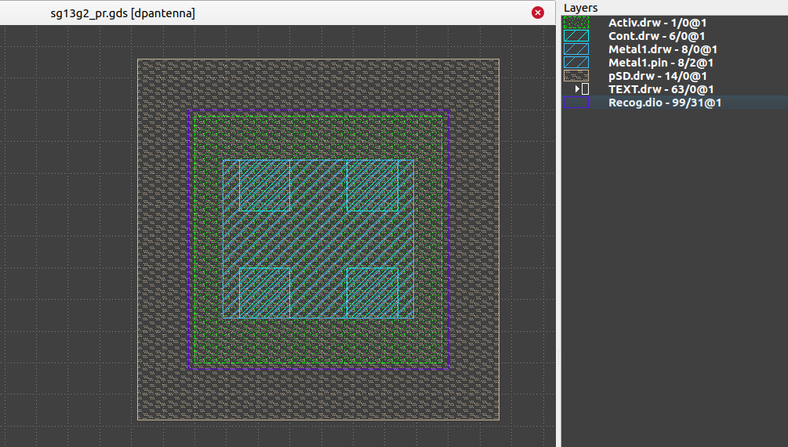

4.5 Diode-Devices
=================

4.5.1 dantenna
--------------

|dantenna           |  |
|dpantenna          |This diode is used to protect against high voltage. 

+---------------------+------------------------------------------------------------------------------+
|Property             |Value                                                                         |
+---------------------+------------------------------------------------------------------------------+
| Description         | Protection diode for MOS gates. Substrate is anode, metal is cathode.        |
+---------------------+------------------------------------------------------------------------------+
| Device Recognition  | Activ + Recog.diode                                                          |
+---------------------+------------------------------------------------------------------------------+
| Model Name          | dantenna                                                                     |
+---------------------+------------------------------------------------------------------------------+
| Layout Cell Name    | sg13g2_pr - dantenna                                                         |
+---------------------+------------------------------------------------------------------------------+
| Netlist Syntax      | `DD0 sub! MINUS dantenna m=1 w=780.00n l=780.00n a=608.400f p=3.12u`         |
+---------------------+------------------------------------------------------------------------------+
| Measured Parameters | Area (a), Perimeter (p)                                                      |
+---------------------+------------------------------------------------------------------------------+
| Additional Notes    | - This diode is used to protect against low voltage.                         |
|                     | - The anode of the diode should be connected to the ptap1 resistor.          |
+---------------------+------------------------------------------------------------------------------+

    Figure 4.5.1 Layout for dantenna device

4.5.2 dpantenna
---------------

+---------------------+------------------------------------------------------------------------------+
|Property             |Value                                                                         |
+---------------------+------------------------------------------------------------------------------+
| Description         | Protection diode for MOS gates. Substrate is cathode, metal is anode.        |
+---------------------+------------------------------------------------------------------------------+
| Device Recognition  | Activ + Recog.diode + pSD                                                    |
+---------------------+------------------------------------------------------------------------------+
| Model Name          | dpantenna                                                                    |
+---------------------+------------------------------------------------------------------------------+
| Layout Cell Name    | sg13g2_pr - dpantenna                                                        |
+---------------------+------------------------------------------------------------------------------+
| Netlist Syntax      | `DD1 PLUS MINUS dpantenna m=1 w=780.00n l=780.00n a=608.400f p=3.12u`        |
+---------------------+------------------------------------------------------------------------------+
| Measured Parameters | Area (a), Perimeter (p)                                                      |
+---------------------+------------------------------------------------------------------------------+
| Additional Notes    | - This diode is used to protect against high voltage.                        |
|                     | - The cathode of the diode should be connected to the ntap1 resistor.        |
+---------------------+------------------------------------------------------------------------------+

    Figure 4.5.2 Layout for dpantenna device
