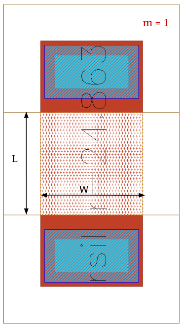

Resistor-Devices
================

rhigh
-----

**Device Information**

.. list-table:: Polysilicon Resistor of a High Sheet Resistance
   :header-rows: 1
   :stub-columns: 1

   * - Property
     - Value
   * - Description
     - High-ohmic poly-Si resistor. It represents an unsalicided partial compensated low n-doped GatPoly resistor.
   * - Device Recognition
     - GatPoly + nSD + pSD + SalBlock + HeatRes + ExtBlock + PolyRes
   * - Model Name
     - rhigh
   * - Layout Cell Name
     - sg13g2_pr - rhigh
   * - Parameters
     - w, l, R, m, ps, Imax
   * - Additional Notes
     - Resistor body is defined by SalBlock drawing layer. 
   * -
     - Sheet resistance of 1360 Ω/.
   * -
     - nSD only within Rhigh resistor device (pSD and nSD are identical).

**Parameters Information**

.. list-table:: Xschem and LVS views Compatibility for rhigh Parameters
   :header-rows: 1
   :stub-columns: 1

   * - Parameter
     - Description
     - Xschem-View
     - LVS-View
   * - W
     - PolyRes Width
     - ✅
     - ✅
   * - L
     - PolyRes Length
     - ✅
     - ✅
   * - ps
     - pSD enclosure of GatPoly
     - ❌
     - ✅
   * - R
     - Resistance Value
     - ❌
     - ✅
   * - m
     - Number of resistors (multiplicity)
     - ✅
     - ✅
   * - Imax
     - Maximum Current
     - ✅
     - ❌

**Layout Information** (Refer to :ref:`layout layers`)

.. image:: images/rhigh_layout.png
    :width: 300
    :align: center
    :alt: rhigh device - layout

.. rst-class:: center

    Figure 4.5.1 Layout for rhigh resistor device

rppd
----

**Device Information**

.. list-table:: Polysilicon Resistor
   :header-rows: 1
   :stub-columns: 1

   * - Property
     - Value
   * - Description
     - Medium resistance poly-Si resistor. It represents the unsalicided p+ doped GatPoly resistor.
   * - Device Recognition
     - GatPoly + pSD + SalBlock + HeatRes + ExtBlock + PolyRes
   * - Model Name
     - rppd
   * - Layout Cell Name
     - sg13g2_pr - rppd
   * - Parameters
     - w, l, R, m, ps, Imax
   * - Additional Notes
     - Resistor body is defined by SalBlock drawing layer. 
   * -
     - Sheet resistance of 7 Ω/.

**Parameters Information**

.. list-table:: Xschem and LVS views Compatibility for rppd Parameters
   :header-rows: 1
   :stub-columns: 1

   * - Parameter
     - Description
     - Xschem-View
     - LVS-View
   * - W
     - PolyRes Width
     - ✅
     - ✅
   * - L
     - PolyRes Length
     - ✅
     - ✅
   * - ps
     - pSD enclosure of GatPoly
     - ❌
     - ✅
   * - R
     - Resistance Value
     - ❌
     - ✅
   * - m
     - Number of resistors (multiplicity)
     - ✅
     - ✅
   * - Imax
     - Maximum Current
     - ✅
     - ❌

**Layout Information** (Refer to :ref:`layout layers`)

.. image:: images/rppd_layout.png
    :width: 300
    :align: center
    :alt: rppd device - layout

.. rst-class:: center

    Figure 4.5.2 Layout for rppd resistor device

rsil
----

**Device Information**

.. list-table:: Silicide Resistor
   :header-rows: 1
   :stub-columns: 1

   * - Property
     - Value
   * - Description
     - Salicided poly-Si resistor (low-ohmic). It represents the salicided n+ doped GatPoly resistor.
   * - Device Recognition
     - GGatPoly + RES + HeatRes + ExtBlock + PolyRes
   * - Model Name
     - rsil
   * - Layout Cell Name
     - sg13g2_pr - rsil
   * - Parameters
     - w, l, R, m, ps, Imax
   * - Additional Notes
     - Resistor body is defined by SalBlock drawing layer. 
   * -
     - Sheet resistance of 7 Ω/.

**Parameters Information**

.. list-table:: Xschem and LVS views Compatibility for rsil Parameters
   :header-rows: 1
   :stub-columns: 1

   * - Parameter
     - Description
     - Xschem-View
     - LVS-View
   * - W
     - PolyRes Width
     - ✅
     - ✅
   * - L
     - PolyRes Length
     - ✅
     - ✅
   * - ps
     - pSD enclosure of GatPoly
     - ❌
     - ✅
   * - R
     - Resistance Value
     - ❌
     - ✅
   * - m
     - Number of resistors (multiplicity)
     - ✅
     - ✅
   * - Imax
     - Maximum Current
     - ✅
     - ❌

**Layout Information** (Refer to :ref:`layout layers`)

.. rst-class:: center

    Figure 4.5.3 Layout for rsil resistor device
