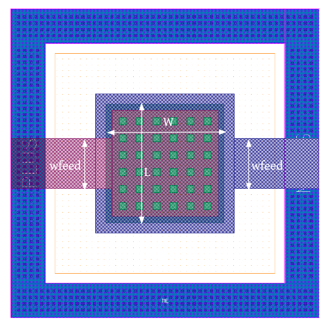
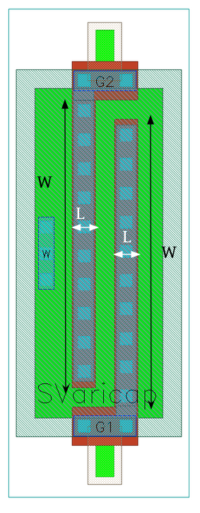

Capacitor-Devices
=================

cmim
----

**Device Information**

.. list-table:: Metal-Insulator-Metal capacitor
   :header-rows: 1
   :stub-columns: 1

   * - Property
     - Value
   * - Description
     - Metal5 - insulator - TopMetal1 capacitor, scalable rectangular shape.
   * - Device Recognition
     - MIM + VMIM + Metal5 + TopMetal1
   * - Model Name
     - cap_cmim
   * - Layout Cell Name
     - sg13g2_pr - cmim
   * - Parameters
     - w, l, c, m
   * - Additional Notes
     - Capacitor body is defined by MIM drawing. Not available with Cu BEOL. 
   * -
     - Within MIM capacitor layer Vmim can be used instead of TopVia1.

**Parameters Information**

.. list-table:: Xschem and LVS views Compatibility for cmim Parameters
   :header-rows: 1
   :stub-columns: 1

   * - Parameter
     - Description
     - Xschem-View
     - LVS-View
   * - W
     - Capacitor Width
     - ✅
     - ✅
   * - L
     - Capacitor Length
     - ✅
     - ✅
   * - C
     - Capacitance Value
     - ❌
     - ✅
   * - m
     - Number of capacitors (multiplicity)
     - ❌
     - ✅
   * - MF
     - Number of capacitors (multiplicity)
     - ✅
     - ❌

**Layout Information** (Refer to :ref:`layout layers`)

.. image:: images/cmim_layout.png
    :width: 600
    :align: center
    :alt: cmim device - layout

.. rst-class:: center

    Figure 4.6.1 Layout for cmim capacitor device

rfcmim
------

**Device Information**

.. list-table:: Metal-Insulator-Metal RF capacitor
   :header-rows: 1
   :stub-columns: 1

   * - Property
     - Value
   * - Description
     - Metal5 - insulator - TopMetal1 capacitor with ptap surrounding and special RF model.
   * - Device Recognition
     - MIM + VMIM + Metal5 + TopMetal1 + PWell.blk + ptap (Activ + pSD)
   * - Model Name
     - rfcmim
   * - Layout Cell Name
     - sg13g2_pr - rfcmim
   * - Parameters
     - w, l, wfeed, C

**Parameters Information**

.. list-table:: Xschem and LVS views Compatibility for rfcmim Parameters
   :header-rows: 1
   :stub-columns: 1

   * - Parameter
     - Description
     - Xschem-View
     - LVS-View
   * - W
     - Capacitor Width
     - ❌
     - ✅
   * - L
     - Capacitor Length
     - ❌
     - ✅
   * - wfeed
     - Capacitor feed width
     - ❌
     - ✅
   * - C
     - Capacitance Value
     - ❌
     - ✅

**Layout Information** (Refer to :ref:`layout layers`)

.. rst-class:: center

    Figure 4.6.2 Layout for rfcmim capacitor device

SVaricap
--------

**Device Information**

.. list-table:: variable capacitor - MOSFET
   :header-rows: 1
   :stub-columns: 1

   * - Property
     - Value
   * - Description
     -  Variable capacitor, available only with thick oxide.
   * - Device Recognition
     - Activ + GatPoly + pSD + Nwell + nBuLay + ThickGateOx
   * - Model Name
     - SVaricap
   * - Layout Cell Name
     - sg13g2_pr - SVaricap
   * - Parameters
     - w, l, Nx
   * - Additional Notes
     - Only two combinations of width and length are allowed. 

**Parameters Information**

.. list-table:: Xschem and LVS views Compatibility for SVaricap Parameters
   :header-rows: 1
   :stub-columns: 1

   * - Parameter
     - Description
     - Xschem-View
     - LVS-View
   * - W
     - Capacitor Width
     - ❌
     - ✅
   * - L
     - Capacitor Length
     - ❌
     - ✅
   * - Nx
     - Capacitance Value
     - ❌
     - ✅

**Layout Information** (Refer to :ref:`layout layers`)

.. rst-class:: center

    Figure 4.6.3 Layout for SVaricap capacitor device
