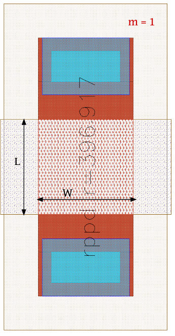

4.6 Resistor-Devices
====================

4.6.1 rhigh
-----------

+---------------------+------------------------------------------------------------------------+
|Property             |Value                                                                   |
+---------------------+------------------------------------------------------------------------+
| Description         | High-ohmic poly-Si resistor.                                           |
+---------------------+------------------------------------------------------------------------+
| Device Recognition  | GatPoly + nSD + pSD + SalBlock + HeatRes + ExtBlock + PolyRes          |
+---------------------+------------------------------------------------------------------------+
| Model Name          | rhigh                                                                  |
+---------------------+------------------------------------------------------------------------+
| Layout Cell Name    | sg13g2_pr - rhigh                                                      |
+---------------------+------------------------------------------------------------------------+
| Netlist Syntax      | `RR1 PLUS MINUS sub! rhigh m=1 l=960.00n w=500.0n ps=180.00n R=3.033K` |
+---------------------+------------------------------------------------------------------------+
| Measured Parameters | w, l, R, m, ps                                                         |
+---------------------+------------------------------------------------------------------------+
| Additional Notes    | - Resistor body is defined by SalBlock drawing layer.                  |
|                     | - Sheet resistance of 1360 $\Omega / \square$                          |
+---------------------+------------------------------------------------------------------------+

.. figure:: images/rhigh_layout.png
    :width: 850
    :align: center
    :alt: rhigh device - layout

    Figure 4.6.1 Layout for rhigh device

4.6.2 rppd
----------

+---------------------+-----------------------------------------------------------------------+
|Property             |Value                                                                  |
+---------------------+-----------------------------------------------------------------------+
| Description         | Medium resistance poly-Si resistor.                                   |
+---------------------+-----------------------------------------------------------------------+
| Device Recognition  | GatPoly + pSD + SalBlock + HeatRes + ExtBlock + PolyRes               |
+---------------------+-----------------------------------------------------------------------+
| Model Name          | rppd                                                                  |
+---------------------+-----------------------------------------------------------------------+
| Layout Cell Name    | sg13g2_pr - rppd                                                      |
+---------------------+-----------------------------------------------------------------------+
| Netlist Syntax      | `RR3 PLUS MINUS sub! rppd m=1 l=500.0n w=500.0n ps=180.00n R=380.385` |
+---------------------+-----------------------------------------------------------------------+
| Measured Parameters | w, l, R, m, ps                                                        |
+---------------------+-----------------------------------------------------------------------+
| Additional Notes    | - Resistor body is defined by SalBlock drawing layer.                 |
|                     | - Sheet resistance of 7 $\Omega / \square$                            |
+---------------------+-----------------------------------------------------------------------+

    Figure 4.6.2 Layout for rppd device

4.6.3 rsil
----------

+---------------------+----------------------------------------------------------------------+
|Property             |Value                                                                 |
+---------------------+----------------------------------------------------------------------+
| Description         | Salicided poly-Si resistor (low-ohmic).                              |
+---------------------+----------------------------------------------------------------------+
| Device Recognition  | GatPoly + RES + HeatRes + ExtBlock + PolyRes                         |
+---------------------+----------------------------------------------------------------------+
| Model Name          | rsil                                                                 |
+---------------------+----------------------------------------------------------------------+
| Layout Cell Name    | sg13g2_pr - rsil                                                     |
+---------------------+----------------------------------------------------------------------+
| Netlist Syntax      | `R2 PLUS MINUS sub! rsil m=1 l=500.0n w=500.0n ps=180.00n R=24.481`  |
+---------------------+----------------------------------------------------------------------+
| Measured Parameters | w, l, R, m, ps                                                       |
+---------------------+----------------------------------------------------------------------+
| Additional Notes    | - Resistor body is defined by RES drawing layer.                     |
|                     | - Sheet resistance of 7 $\Omega / \square$                           |
+---------------------+----------------------------------------------------------------------+

.. figure:: images/rsil_layout.png
    :width: 850
    :align: center
    :alt: rsil device - layout

    Figure 4.6.3 Layout for rsil device
