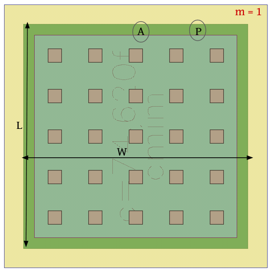
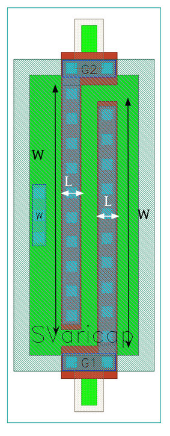

4.7 Capacitor-Devices
=====================

4.7.1 cmim
----------

+---------------------+-------------------------------------------------------------------------+
|Property             |Value                                                                    |
+---------------------+-------------------------------------------------------------------------+
| Description         | Metal5 - insulator - TopMetal1 capacitor, scalable rectangular shape.   |
+---------------------+-------------------------------------------------------------------------+
| Device Recognition  | MIM + VMIM + Metal5 + TopMetal1                                         |
+---------------------+-------------------------------------------------------------------------+
| Model Name          | cap_cmim                                                                |
+---------------------+-------------------------------------------------------------------------+
| Layout Cell Name    | sg13g2_pr - cmim                                                        |
+---------------------+-------------------------------------------------------------------------+
| Netlist Syntax      | `CC0 PLUS MINUS cap_cmim m=1 w=6.99u l=6.99u c=74.62f`                  |
+---------------------+-------------------------------------------------------------------------+
| Measured Parameters | A, P, c, m                                                              |
+---------------------+-------------------------------------------------------------------------+
| Additional Notes    | - Capacitor body is defined by MIM drawing. Not available with Cu BEOL. |
+---------------------+-------------------------------------------------------------------------+

    Figure 4.7.1 Layout for cmim device

4.7.2 SVaricap
--------------

+---------------------+----------------------------------------------------------+
|Property             |Value                                                     |
+---------------------+----------------------------------------------------------+
| Description         | Available only with thick oxide.                         |
+---------------------+----------------------------------------------------------+
| Device Recognition  | Activ + GatPoly + pSD + Nwell + nBuLay + ThickGateOx     |
+---------------------+----------------------------------------------------------+
| Model Name          | SVaricap                                                 |
+---------------------+----------------------------------------------------------+
| Layout Cell Name    | sg13g2_pr - SVaricap                                     |
+---------------------+----------------------------------------------------------+
| Netlist Syntax      | `XD2 G1 W G2 sub! SVaricap l=0.3u w=3.74u Nx=1`          |
+---------------------+----------------------------------------------------------+
| Measured Parameters | w, l, Nx                                                 |
+---------------------+----------------------------------------------------------+
| Additional Notes    | - Only two combinations of width and length are allowed. |
+---------------------+----------------------------------------------------------+

    Figure 4.7.2 Layout for SVaricap device
