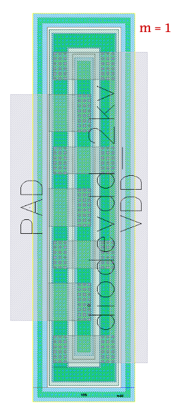
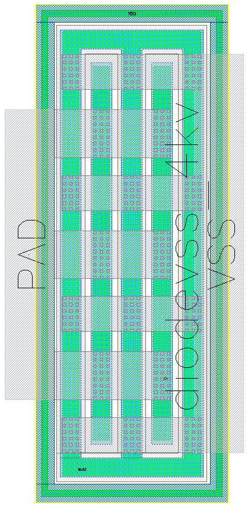
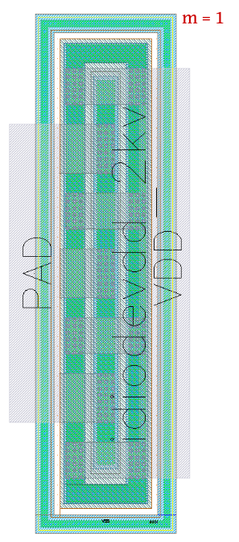
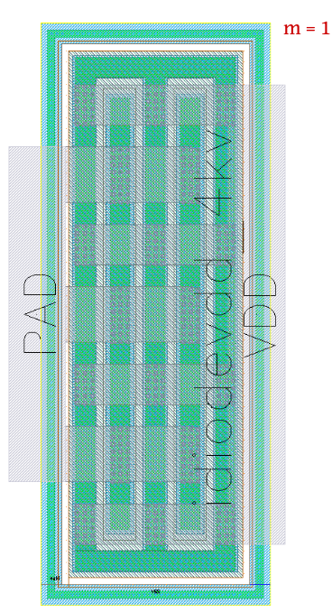
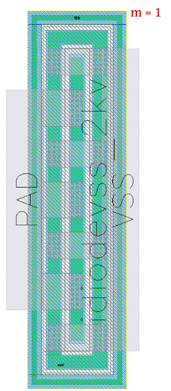
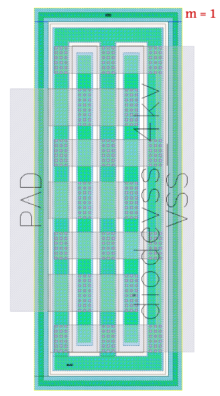
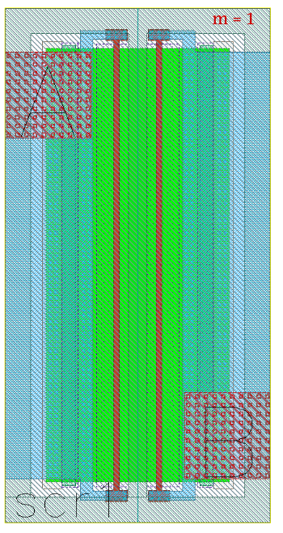

ESD-Devices
===========

.. tip::
  All ESD devices come in predetermined sizes, and the only parameter we keep track of is 'm', which is the number of ESD devices (multiplicity).

diodevdd_2k
-----------

**Device Information**

.. list-table:: VDD diode - 2k
   :header-rows: 1
   :stub-columns: 1

   * - Property
     - Value
   * - Description
     - VDD diode. One p+ stripe in n-well.
   * - Device Recognition
     - Activ, pSD, Nwell, Recog.esd
   * - Model Name
     - diodevdd_2kv
   * - Layout Cell Name
     - sg13g2_pr - diodevdd_2kv
   * - Parameters
     - m
   * - Netlist Syntax
     - `D1 VDD PAD VSS diodevdd_2kv m=1`
   * - Additional Notes
     - Junction area = 27.78 x 1.26 (x1) um2. 

**Parameters Information**

.. list-table:: Schematic and LVS views Compatibility for diodevdd_2k Parameters
   :header-rows: 1
   :stub-columns: 1

   * - Parameter
     - Description
     - Schematic-View
     - LVS-View
     - LVS-Comparison
   * - m
     - Number of ESD devices (multiplicity)
     - ❌
     - ✅
     - ✅

**Layout Information** (Refer to :ref:`layout layers`)

.. rst-class:: center

    Figure 4.7.1 Layout for diodevdd_2k ESD device

diodevdd_4k
-----------

**Device Information**

.. list-table:: VDD diode - 4k
   :header-rows: 1
   :stub-columns: 1

   * - Property
     - Value
   * - Description
     - VDD diode. Two p+ stripe in n-well.
   * - Device Recognition
     - Activ, pSD, Nwell, Recog.esd
   * - Model Name
     - diodevdd_4kv
   * - Layout Cell Name
     - sg13g2_pr - diodevdd_4kv
   * - Parameters
     - m
   * - Netlist Syntax
     - `D1 VDD PAD VSS diodevdd_4kv m=1`
   * - Additional Notes
     - Junction area = 27.78 x 1.26 (x2) um2. 

**Parameters Information**

.. list-table:: Schematic and LVS views Compatibility for diodevdd_4k Parameters
   :header-rows: 1
   :stub-columns: 1

   * - Parameter
     - Description
     - Schematic-View
     - LVS-View
     - LVS-Comparison
   * - m
     - Number of devices (multiplicity)
     - ❌
     - ✅
     - ✅

**Layout Information** (Refer to :ref:`layout layers`)

.. image:: images/diodevdd_4k_layout.png
    :width: 250
    :align: center
    :alt: diodevdd_4kv device - layout

.. rst-class:: center

    Figure 4.7.2 Layout for diodevdd_4kv ESD device

diodevss_2k
-----------

**Device Information**

.. list-table:: VSS diode - 2k
   :header-rows: 1
   :stub-columns: 1

   * - Property
     - Value
   * - Description
     - VSS diode. One n+ stripe in p-well (Nwell hole).
   * - Device Recognition
     - Activ, pSD, Nwell, Recog.esd
   * - Model Name
     - diodevss_2kv
   * - Layout Cell Name
     - sg13g2_pr - diodevss_2kv
   * - Parameters
     - m
   * - Netlist Syntax
     - `D1 VDD PAD VSS diodevss_2kv m=1`
   * - Additional Notes
     - Junction area = 27.78 x 1.26 (x1) um2. 

**Parameters Information**

.. list-table:: Schematic and LVS views Compatibility for diodevss_2k Parameters
   :header-rows: 1
   :stub-columns: 1

   * - Parameter
     - Description
     - Schematic-View
     - LVS-View
     - LVS-Comparison
   * - m
     - Number of devices (multiplicity)
     - ❌
     - ✅
     - ✅

**Layout Information** (Refer to :ref:`layout layers`)

.. rst-class:: center

    Figure 4.7.3 Layout for diodevss_2k ESD device

diodevss_4k
-----------

**Device Information**

.. list-table:: VSS diode - 4k
   :header-rows: 1
   :stub-columns: 1

   * - Property
     - Value
   * - Description
     - VSS diode. Two n+ stripe in p-well (Nwell hole).
   * - Device Recognition
     - Activ, pSD, Nwell, Recog.esd
   * - Model Name
     - diodevss_4kv
   * - Layout Cell Name
     - sg13g2_pr - diodevss_4kv
   * - Parameters
     - m
   * - Netlist Syntax
     - `D1 VDD PAD VSS diodevss_4kv m=1`
   * - Additional Notes
     - Junction area = 27.78 x 1.26 (x2) um2. 

**Parameters Information**

.. list-table:: Schematic and LVS views Compatibility for diodevss_4k Parameters
   :header-rows: 1
   :stub-columns: 1

   * - Parameter
     - Description
     - Schematic-View
     - LVS-View
     - LVS-Comparison
   * - m
     - Number of devices (multiplicity)
     - ❌
     - ✅
     - ✅

**Layout Information** (Refer to :ref:`layout layers`)

.. rst-class:: center

    Figure 4.7.4 Layout for diodevss_4kv ESD device

idiodevdd_2k
------------

**Device Information**

.. list-table:: Isolated VDD diode - 2k
   :header-rows: 1
   :stub-columns: 1

   * - Property
     - Value
   * - Description
     - Isolated VDD diode. One p+ stripe in n-well.
   * - Device Recognition
     - Activ, pSD, Nwell, Recog.esd, nBuLay, PWell.blk
   * - Model Name
     - idiodevdd_2kv
   * - Layout Cell Name
     - sg13g2_pr - idiodevdd_2kv
   * - Parameters
     - m
   * - Netlist Syntax
     - `D1 VDD PAD VSS idiodevdd_2kv m=1`
   * - Additional Notes
     - Junction area = 27.78 x 1.26 (x1) um2. 

**Parameters Information**

.. list-table:: Schematic and LVS views Compatibility for idiodevdd_2k Parameters
   :header-rows: 1
   :stub-columns: 1

   * - Parameter
     - Description
     - Schematic-View
     - LVS-View
     - LVS-Comparison
   * - m
     - Number of devices (multiplicity)
     - ❌
     - ✅
     - ✅

**Layout Information** (Refer to :ref:`layout layers`)

.. rst-class:: center

    Figure 4.7.5 Layout for idiodevdd_2k ESD device

idiodevdd_4k
------------

**Device Information**

.. list-table:: Isolated VDD diode - 4k
   :header-rows: 1
   :stub-columns: 1

   * - Property
     - Value
   * - Description
     - Isolated VDD diode. Two p+ stripe in n-well.
   * - Device Recognition
     - Activ, pSD, Nwell, Recog.esd
   * - Model Name
     - idiodevdd_4kv
   * - Layout Cell Name
     - sg13g2_pr - idiodevdd_4kv
   * - Parameters
     - m
   * - Netlist Syntax
     - `D1 VDD PAD VSS idiodevdd_4kv m=1`
   * - Additional Notes
     - Junction area = 27.78 x 1.26 (x2) um2. 

**Parameters Information**

.. list-table:: Schematic and LVS views Compatibility for idiodevdd_4k Parameters
   :header-rows: 1
   :stub-columns: 1

   * - Parameter
     - Description
     - Schematic-View
     - LVS-View
     - LVS-Comparison
   * - m
     - Number of devices (multiplicity)
     - ❌
     - ✅
     - ✅

**Layout Information** (Refer to :ref:`layout layers`)

.. rst-class:: center

    Figure 4.7.6 Layout for idiodevdd_4kv ESD device

idiodevss_2k
------------

**Device Information**

.. list-table:: Isolated VSS diode - 2k
   :header-rows: 1
   :stub-columns: 1

   * - Property
     - Value
   * - Description
     - Isolated VSS diode. One n+ stripe in p-well (Nwell hole).
   * - Device Recognition
     - Activ, pSD, Nwell, Recog.esd
   * - Model Name
     - idiodevss_2kv
   * - Layout Cell Name
     - sg13g2_pr - idiodevss_2kv
   * - Parameters
     - m
   * - Netlist Syntax
     - `D1 VDD PAD VSS idiodevss_2kv m=1`
   * - Additional Notes
     - Junction area = 27.78 x 1.26 (x1) um2. 

**Parameters Information**

.. list-table:: Schematic and LVS views Compatibility for idiodevss_2k Parameters
   :header-rows: 1
   :stub-columns: 1

   * - Parameter
     - Description
     - Schematic-View
     - LVS-View
     - LVS-Comparison
   * - m
     - Number of devices (multiplicity)
     - ❌
     - ✅
     - ✅

**Layout Information** (Refer to :ref:`layout layers`)

.. rst-class:: center

    Figure 4.7.5 Layout for idiodevss_2k ESD device

idiodevss_4k
------------

**Device Information**

.. list-table:: Isolated VSS diode - 4k
   :header-rows: 1
   :stub-columns: 1

   * - Property
     - Value
   * - Description
     - Isolated VSS diode. Two n+ stripe in p-well (Nwell hole).
   * - Device Recognition
     - Activ, pSD, Nwell, Recog.esd
   * - Model Name
     - idiodevss_4kv
   * - Layout Cell Name
     - sg13g2_pr - idiodevss_4kv
   * - Parameters
     - m
   * - Netlist Syntax
     - `D1 VDD PAD VSS idiodevss_4kv m=1`
   * - Additional Notes
     - Junction area = 27.78 x 1.26 (x2) um2. 

**Parameters Information**

.. list-table:: Schematic and LVS views Compatibility for idiodevss_4k Parameters
   :header-rows: 1
   :stub-columns: 1

   * - Parameter
     - Description
     - Schematic-View
     - LVS-View
     - LVS-Comparison
   * - m
     - Number of devices (multiplicity)
     - ❌
     - ✅
     - ✅

**Layout Information** (Refer to :ref:`layout layers`)

.. rst-class:: center

    Figure 4.7.8 Layout for idiodevss_4kv ESD device

nmoscl_2
--------

**Device Information**

.. list-table::  Isolated NMOS - ESD-2
   :header-rows: 1
   :stub-columns: 1

   * - Property
     - Value
   * - Description
     - Isolated NMOS with the silicidation protection mask for the drain region
   * - Device Recognition
     - Activ, GatPoly, pSD, SalBlock, Nwell, nBuLay, Substrate, ThickGateOx, Recog, Recog.esd
   * - Model Name
     - nmoscl_2
   * - Layout Cell Name
     - sg13g2_pr - nmoscl_2
   * - Parameters
     - m
   * - Netlist Syntax
     - `D1 VDD VSS nmoscl_2 m=1`
   * - Additional Notes
     - This is the grounded gate NMOS device for clamp.  
   * - 
     - Corresponding widths are 12 fingers.
   * - 
     - Gate length is taken to be always 0.36 um.

**Parameters Information**

.. list-table:: Schematic and LVS views Compatibility for nmoscl_2 Parameters
   :header-rows: 1
   :stub-columns: 1

   * - Parameter
     - Description
     - Schematic-View
     - LVS-View
     - LVS-Comparison
   * - m
     - Number of devices (multiplicity)
     - ❌
     - ✅
     - ✅

**Layout Information** (Refer to :ref:`layout layers`)

.. image:: images/nmoscl_2_layout.png
    :width: 800
    :align: center
    :alt: nmoscl_2 device - layout

.. rst-class:: center

    Figure 4.7.9 Layout for nmoscl_2 ESD device

nmoscl_4
--------

**Device Information**

.. list-table::  Isolated NMOS - ESD-4
   :header-rows: 1
   :stub-columns: 1

   * - Property
     - Value
   * - Description
     - Isolated NMOS with the silicidation protection mask for the drain region
   * - Device Recognition
     - Activ, GatPoly, pSD, SalBlock, Nwell, nBuLay, Substrate, ThickGateOx, Recog, Recog.esd
   * - Model Name
     - nmoscl_4
   * - Layout Cell Name
     - sg13g2_pr - nmoscl_4
   * - Parameters
     - m
   * - Netlist Syntax
     - `D1 VDD VSS nmoscl_2 m=1`
   * - Additional Notes
     - This is the grounded gate NMOS device for clamp.  
   * - 
     - Corresponding widths are 24 fingers.
   * - 
     - Gate length is taken to be always 0.36 um.

**Parameters Information**

.. list-table:: Schematic and LVS views Compatibility for nmoscl_4 Parameters
   :header-rows: 1
   :stub-columns: 1

   * - Parameter
     - Description
     - Schematic-View
     - LVS-View
     - LVS-Comparison
   * - m
     - Number of devices (multiplicity)
     - ❌
     - ✅
     - ✅

**Layout Information** (Refer to :ref:`layout layers`)

.. rst-class:: center

    Figure 4.7.10 Layout for nmoscl_4 ESD device

scr1
----

.. note:: 
    This device is currently a **work in progress**.

**Device Information**

.. list-table::  scr1 - ESD
   :header-rows: 1
   :stub-columns: 1

   * - Property
     - Value
   * - Description
     - Silicon Control Rectifier (Thyristor)
   * - Device Recognition
     - Activ, GatPoly, pSD, SalBlock, Nwell, nBuLay, Substrate, ThickGateOx, nSD.blk, Recog.esd
   * - Model Name
     - scr1
   * - Layout Cell Name
     - sg13g2_pr - scr1
   * - Parameters
     - m

**Parameters Information**

.. list-table:: Schematic and LVS views Compatibility for scr1 Parameters
   :header-rows: 1
   :stub-columns: 1

   * - Parameter
     - Description
     - Schematic-View
     - LVS-View
     - LVS-Comparison
   * - m
     - Number of ESD device (multiplicity)
     - ❌
     - ❌
     - ❌

**Layout Information** (Refer to :ref:`layout layers`)

.. rst-class:: center

    Figure 4.7.11 Layout for scr1 ESD device
