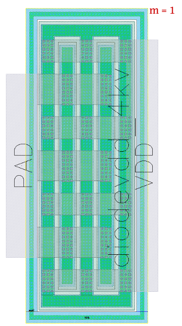

ESD-Devices
===========

diodevdd_2k
-----------

**Device Information**

.. list-table:: VDD diode - 2k
   :header-rows: 1
   :stub-columns: 1

   * - Property
     - Value
   * - Description
     - VDD diode. One p+ stripe in n-well.
   * - Device Recognition
     - Activ + pSD + Nwell + Recog.esd
   * - Model Name
     - diodevdd_2kv
   * - Layout Cell Name
     - sg13g2_pr - diodevdd_2kv
   * - Parameters
     - m
   * - Additional Notes
     - Junction area = 27.78 x 1.26 (x1) um2. 

**Parameters Information**

.. list-table:: Xschem and LVS views Compatibility for diodevdd_2k Parameters
   :header-rows: 1
   :stub-columns: 1

   * - Parameter
     - Description
     - Xschem-View
     - LVS-View
   * - m
     - Number of ESD diodevdd_2k device (multiplicity)
     - ❌
     - ✅

**Layout Information** (Refer to :ref:`layout layers`)

.. image:: images/diodevdd_2k_layout.png
    :width: 300
    :align: center
    :alt: diodevdd_2k device - layout

.. rst-class:: center

    Figure 4.7.1 Layout for diodevdd_2k ESD device

diodevdd_4k
-----------

**Device Information**

.. list-table:: VDD diode - 4k
   :header-rows: 1
   :stub-columns: 1

   * - Property
     - Value
   * - Description
     - VDD diode. Two p+ stripe in n-well.
   * - Device Recognition
     - Activ + pSD + Nwell + Recog.esd
   * - Model Name
     - diodevdd_4kv
   * - Layout Cell Name
     - sg13g2_pr - diodevdd_4kv
   * - Parameters
     - m
   * - Additional Notes
     - Junction area = 27.78 x 1.26 (x2) um2. 

**Parameters Information**

.. list-table:: Xschem and LVS views Compatibility for diodevdd_2k Parameters
   :header-rows: 1
   :stub-columns: 1

   * - Parameter
     - Description
     - Xschem-View
     - LVS-View
   * - m
     - Number of ESD diodevdd_4k device (multiplicity)
     - ❌
     - ✅

**Layout Information** (Refer to :ref:`layout layers`)

.. rst-class:: center

    Figure 4.7.2 Layout for diodevdd_4kv ESD device

diodevss_2k
-----------

**Device Information**

.. list-table:: VSS diode - 2k
   :header-rows: 1
   :stub-columns: 1

   * - Property
     - Value
   * - Description
     - VSS diode. One n+ stripe in p-well (Nwell hole).
   * - Device Recognition
     - Activ + pSD + Nwell + Recog.esd
   * - Model Name
     - diodevss_2kv
   * - Layout Cell Name
     - sg13g2_pr - diodevss_2kv
   * - Parameters
     - m
   * - Additional Notes
     - Junction area = 27.78 x 1.26 (x1) um2. 

**Parameters Information**

.. list-table:: Xschem and LVS views Compatibility for diodevdd_2k Parameters
   :header-rows: 1
   :stub-columns: 1

   * - Parameter
     - Description
     - Xschem-View
     - LVS-View
   * - m
     - Number of ESD diodevss_2k device (multiplicity)
     - ❌
     - ✅

**Layout Information** (Refer to :ref:`layout layers`)

.. image:: images/diodevss_2k_layout.png
    :width: 300
    :align: center
    :alt: diodevss_2k device - layout

.. rst-class:: center

    Figure 4.7.3 Layout for diodevss_2k ESD device

diodevss_4k
-----------

**Device Information**

.. list-table:: VSS diode - 4k
   :header-rows: 1
   :stub-columns: 1

   * - Property
     - Value
   * - Description
     - VSS diode. Two n+ stripe in p-well (Nwell hole).
   * - Device Recognition
     - Activ + pSD + Nwell + Recog.esd
   * - Model Name
     - diodevss_4kv
   * - Layout Cell Name
     - sg13g2_pr - diodevss_4kv
   * - Parameters
     - m
   * - Additional Notes
     - Junction area = 27.78 x 1.26 (x2) um2. 

**Parameters Information**

.. list-table:: Xschem and LVS views Compatibility for diodevdd_2k Parameters
   :header-rows: 1
   :stub-columns: 1

   * - Parameter
     - Description
     - Xschem-View
     - LVS-View
   * - m
     - Number of ESD diodevss_4k device (multiplicity)
     - ❌
     - ✅

**Layout Information** (Refer to :ref:`layout layers`)

.. image:: images/diodevss_4k_layout.png
    :width: 300
    :align: center
    :alt: diodevss_4kv device - layout

.. rst-class:: center

    Figure 4.7.4 Layout for diodevss_4kv ESD device

nmoscl_2
--------

**Device Information**

.. list-table::  Isolated NMOS - ESD-2
   :header-rows: 1
   :stub-columns: 1

   * - Property
     - Value
   * - Description
     - Isolated NMOS with the silicidation protection mask for the drain region
   * - Device Recognition
     - Activ + GatPoly + pSD + SalBlock + Nwell + nBuLay + Substrate + ThickGateOx + Recog + Recog.esd
   * - Model Name
     - nmoscl_2
   * - Layout Cell Name
     - sg13g2_pr - nmoscl_2
   * - Parameters
     - m
   * - Additional Notes
     - This is the grounded gate NMOS device for clamp.  
   * - 
     - Corresponding widths are 12 fingers.
   * - 
     - Gate length is taken to be always 0.36 um.

**Parameters Information**

.. list-table:: Xschem and LVS views Compatibility for nmoscl_2 Parameters
   :header-rows: 1
   :stub-columns: 1

   * - Parameter
     - Description
     - Xschem-View
     - LVS-View
   * - m
     - Number of ESD nmoscl_2 device (multiplicity)
     - ❌
     - ✅

**Layout Information** (Refer to :ref:`layout layers`)

.. image:: images/nmoscl_2_layout.png
    :width: 800
    :align: center
    :alt: nmoscl_2 device - layout

.. rst-class:: center

    Figure 4.7.5 Layout for nmoscl_2 ESD device

nmoscl_4
--------

**Device Information**

.. list-table::  Isolated NMOS - ESD-4
   :header-rows: 1
   :stub-columns: 1

   * - Property
     - Value
   * - Description
     - Isolated NMOS with the silicidation protection mask for the drain region
   * - Device Recognition
     - Activ + GatPoly + pSD + SalBlock + Nwell + nBuLay + Substrate + ThickGateOx + Recog + Recog.esd
   * - Model Name
     - nmoscl_4
   * - Layout Cell Name
     - sg13g2_pr - nmoscl_4
   * - Parameters
     - m
   * - Additional Notes
     - This is the grounded gate NMOS device for clamp.  
   * - 
     - Corresponding widths are 24 fingers.
   * - 
     - Gate length is taken to be always 0.36 um.

**Parameters Information**

.. list-table:: Xschem and LVS views Compatibility for nmoscl_2 Parameters
   :header-rows: 1
   :stub-columns: 1

   * - Parameter
     - Description
     - Xschem-View
     - LVS-View
   * - m
     - Number of ESD nmoscl_4 device (multiplicity)
     - ❌
     - ✅

**Layout Information** (Refer to :ref:`layout layers`)

.. image:: images/nmoscl_4_layout.png
    :width: 800
    :align: center
    :alt: nmoscl_4 device - layout

.. rst-class:: center

    Figure 4.7.6 Layout for nmoscl_4 ESD device
