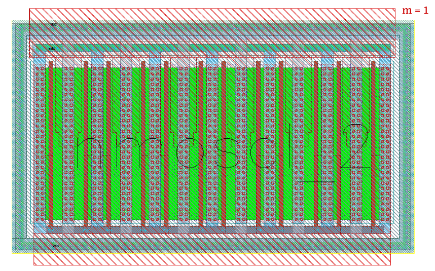

4.8 ESD-Devices
===============

4.8.1 diodevdd_2k
-----------------

+---------------------+------------------------------------------+
|Property             |Value                                     |
+---------------------+------------------------------------------+
| Description         | VDD diode. One p+ stripe in n-well.      |
+---------------------+------------------------------------------+
| Device Recognition  | Activ + pSD + Nwell + Recog.esd          |
+---------------------+------------------------------------------+
| Model Name          | diodevdd_2kv                             |
+---------------------+------------------------------------------+
| Layout Cell Name    | sg13g2_pr - diodevdd_2kv                 |
+---------------------+------------------------------------------+
| Netlist Syntax      | `XD3 VDD PAD VSS diodevdd_2kv m=1`       |
+---------------------+------------------------------------------+
| Measured Parameters | m                                        |
+---------------------+------------------------------------------+
| Additional Notes    | - Junction area = 27.78 x 1.26 (x1) um2. |
+---------------------+------------------------------------------+

.. figure:: images/diodevdd_2k_layout.png
    :width: 850
    :align: center
    :alt: diodevdd_2k device - layout

    Figure 4.8.1 Layout for diodevdd_2k device

4.8.2 diodevdd_4k
-----------------

+---------------------+------------------------------------------+
|Property             |Value                                     |
+---------------------+------------------------------------------+
| Description         | VDD diode. Two p+ stripe in n-well.      |
+---------------------+------------------------------------------+
| Device Recognition  | Activ + pSD + Nwell + Recog.esd          |
+---------------------+------------------------------------------+
| Model Name          | diodevdd_4kv                             |
+---------------------+------------------------------------------+
| Layout Cell Name    | sg13g2_pr - diodevdd_4kv                 |
+---------------------+------------------------------------------+
| Netlist Syntax      | `XD4 VDD PAD VSS diodevdd_4kv m=1`       |
+---------------------+------------------------------------------+
| Measured Parameters | m                                        |
+---------------------+------------------------------------------+
| Additional Notes    | - Junction area = 27.78 x 1.26 (x2) um2. |
+---------------------+------------------------------------------+

.. figure:: images/diodevdd_4kv_layout.png
    :width: 850
    :align: center
    :alt: diodevdd_4kv device - layout

    Figure 4.8.2 Layout for diodevdd_4kv device

4.8.3 diodevss_2k
-----------------

+---------------------+--------------------------------------------------+
|Property             |Value                                             |
+---------------------+--------------------------------------------------+
| Description         | VSS diode. One n+ stripe in p-well (Nwell hole). |
+---------------------+--------------------------------------------------+
| Device Recognition  | Activ + pSD + Nwell + Recog.esd                  |
+---------------------+--------------------------------------------------+
| Model Name          | diodevss_2kv                                     |
+---------------------+--------------------------------------------------+
| Layout Cell Name    | sg13g2_pr - diodevss_2kv                         |
+---------------------+--------------------------------------------------+
| Netlist Syntax      | `XD5 VDD PAD VSS diodevss_2kv m=1`               |
+---------------------+--------------------------------------------------+
| Measured Parameters | m                                                |
+---------------------+--------------------------------------------------+
| Additional Notes    | - Junction area = 27.78 x 1.26 (x1) um2.         |
+---------------------+--------------------------------------------------+

.. figure:: images/diodevss_2kv_layout.png
    :width: 850
    :align: center
    :alt: diodevss_2kv device - layout

    Figure 4.8.3 Layout for diodevss_2kv device

4.8.4 diodevss_4k
-----------------

+---------------------+--------------------------------------------------+
|Property             |Value                                             |
+---------------------+--------------------------------------------------+
| Description         | VSS diode. Two n+ stripe in p-well (Nwell hole). |
+---------------------+--------------------------------------------------+
| Device Recognition  | Activ + pSD + Nwell + Recog.esd                  |
+---------------------+--------------------------------------------------+
| Model Name          | diodevss_4kv                                     |
+---------------------+--------------------------------------------------+
| Layout Cell Name    | sg13g2_pr - diodevss_4kv                         |
+---------------------+--------------------------------------------------+
| Netlist Syntax      | `XD6 VDD PAD VSS diodevss_4kv m=1`               |
+---------------------+--------------------------------------------------+
| Measured Parameters | m                                                |
+---------------------+--------------------------------------------------+
| Additional Notes    | - Junction area = 27.78 x 1.26 (x2) um2.         |
+---------------------+--------------------------------------------------+

.. figure:: images/diodevss_4kv_layout.png
    :width: 850
    :align: center
    :alt: diodevss_4kv device - layout

    Figure 4.8.4 Layout for diodevss_4kv device

4.8.5 nmoscl_2
--------------

+---------------------+-------------------------------------------------------------------------------------------------+
|Property             |Value                                                                                            |
+---------------------+-------------------------------------------------------------------------------------------------+
| Description         | Isolated NMOS with the silicidation protection mask for the drain region                        |
+---------------------+-------------------------------------------------------------------------------------------------+
| Device Recognition  | Activ + GatPoly + pSD + SalBlock + Nwell + nBuLay + Substrate + ThickGateOx + Recog + Recog.esd |
+---------------------+-------------------------------------------------------------------------------------------------+
| Model Name          | nmoscl_2                                                                                        |
+---------------------+-------------------------------------------------------------------------------------------------+
| Layout Cell Name    | sg13g2_pr - nmoscl_2                                                                            |
+---------------------+-------------------------------------------------------------------------------------------------+
| Netlist Syntax      | `DD7 VDD VSS nmoscl_2 m=1`                                                                      |
+---------------------+-------------------------------------------------------------------------------------------------+
| Measured Parameters | m                                                                                               |
+---------------------+-------------------------------------------------------------------------------------------------+
| Additional Notes    | - This is the grounded gate NMOS device for clamp.                                              |
|                     | - Corresponding widths are 12 fingers                                                           |
|                     | - Gate length is taken to be always 0.36 um.                                                    |
+---------------------+-------------------------------------------------------------------------------------------------+

    Figure 4.8.4 Layout for nmoscl_2 device

4.8.6 nmoscl_4
--------------

+---------------------+-------------------------------------------------------------------------------------------------+
|Property             |Value                                                                                            |
+---------------------+-------------------------------------------------------------------------------------------------+
| Description         | Isolated NMOS with the silicidation protection mask for the drain region                        |
+---------------------+-------------------------------------------------------------------------------------------------+
| Device Recognition  | Activ + GatPoly + pSD + SalBlock + Nwell + nBuLay + Substrate + ThickGateOx + Recog + Recog.esd |
+---------------------+-------------------------------------------------------------------------------------------------+
| Model Name          | nmoscl_4                                                                                        |
+---------------------+-------------------------------------------------------------------------------------------------+
| Layout Cell Name    | sg13g2_pr - nmoscl_4                                                                            |
+---------------------+-------------------------------------------------------------------------------------------------+
| Netlist Syntax      | `DD8 VDD VSS nmoscl_4 m=1`                                                                      |
+---------------------+-------------------------------------------------------------------------------------------------+
| Measured Parameters | m                                                                                               |
+---------------------+-------------------------------------------------------------------------------------------------+
| Additional Notes    | - This is the grounded gate NMOS device for clamp.                                              |
|                     | - Corresponding widths are 24 fingers                                                           |
|                     | - Gate length is taken to be always 0.36 um.                                                    |
+---------------------+-------------------------------------------------------------------------------------------------+

.. figure:: images/nmoscl_4_layout.png
    :width: 850
    :align: center
    :alt: nmoscl_4 device - layout

    Figure 4.8.4 Layout for nmoscl_4 device
