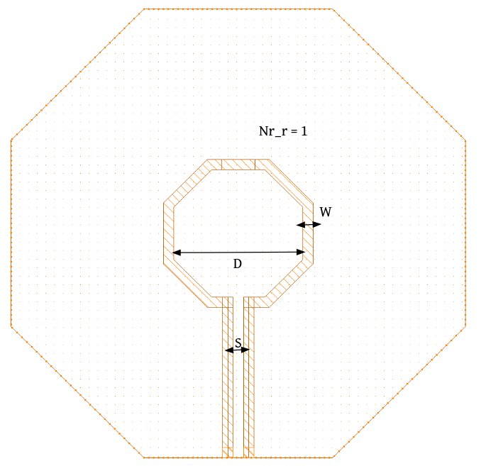
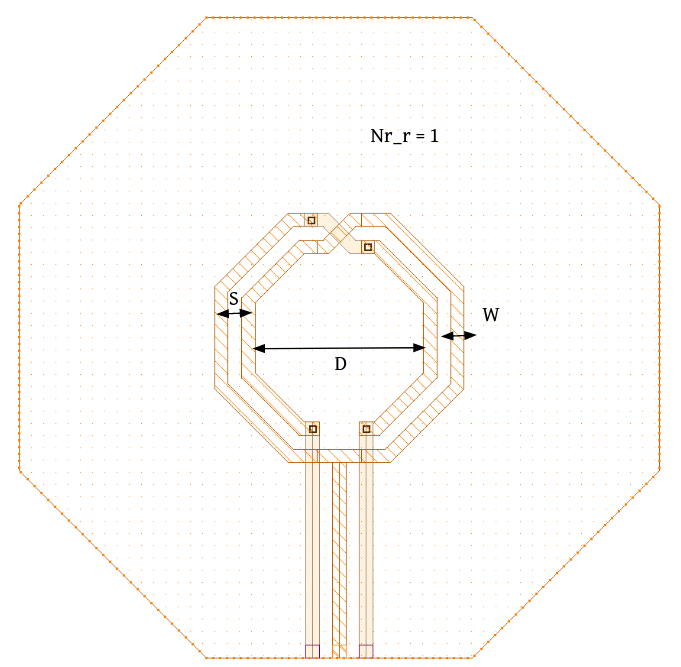

inductor-Devices
================

inductor2
---------

**Device Information**

.. list-table:: Inductor2
   :header-rows: 1
   :stub-columns: 1

   * - Property
     - Value
   * - Description
     - 2-Terminal inductor (Single output)
   * - Device Recognition
     - IND, TopMetal2, PWell.blk, nfl
   * - Model Name
     - inductor2
   * - Layout Cell Name
     - sg13g2_pr - inductor2
   * - Parameters
     - w s d nr_r
   * - Additional Notes
     - Sounded by filler exclusion layer for all metals, activ and GatPoly layers.

**Parameters Information**

.. list-table:: Schematic and LVS views Compatibility for inductor2 Parameters
   :header-rows: 1
   :stub-columns: 1

   * - Parameter
     - Description
     - Schematic-View
     - LVS-View
     - LVS-Comparison
   * - W
     - Width of inductor metal lines
     - ❌
     - ✅
     - ✅
   * - S
     - Spacing between metal lines of inductor
     - ❌
     - ✅
     - ✅
   * - D
     - Diameter of the inductor
     - ❌
     - ✅
     - ✅
   * - nr_r
     -  Number of turns
     - ❌
     - ✅
     - ✅

**Layout Information** (Refer to :ref:`layout layers`)

.. rst-class:: center

    Figure 4.8.1 Layout for inductor2 device

inductor3
---------

**Device Information**

.. list-table:: Inductor3
   :header-rows: 1
   :stub-columns: 1

   * - Property
     - Value
   * - Description
     - 3-Terminal inductor (Differential output)
   * - Device Recognition
     - IND, TopMetal2, PWell.blk
   * - Model Name
     - inductor3
   * - Layout Cell Name
     - sg13g2_pr - inductor3
   * - Parameters
     - w s d nr_r
   * - Additional Notes
     - Sounded by filler exclusion layer for all metals, activ and GatPoly layers.

**Parameters Information**

.. list-table:: Schematic and LVS views Compatibility for Inductor3 Parameters
   :header-rows: 1
   :stub-columns: 1

   * - Parameter
     - Description
     - Schematic-View
     - LVS-View
     - LVS-Comparison
   * - W
     - Width of inductor metal lines
     - ❌
     - ✅
     - ✅
   * - S
     - Spacing between metal lines of inductor
     - ❌
     - ✅
     - ✅
   * - D
     - Diameter of the inductor
     - ❌
     - ✅
     - ✅
   * - nr_r
     -  Number of turns
     - ❌
     - ✅
     - ✅

**Layout Information** (Refer to :ref:`layout layers`)

.. rst-class:: center

    Figure 4.8.2 Layout for inductor3 device
