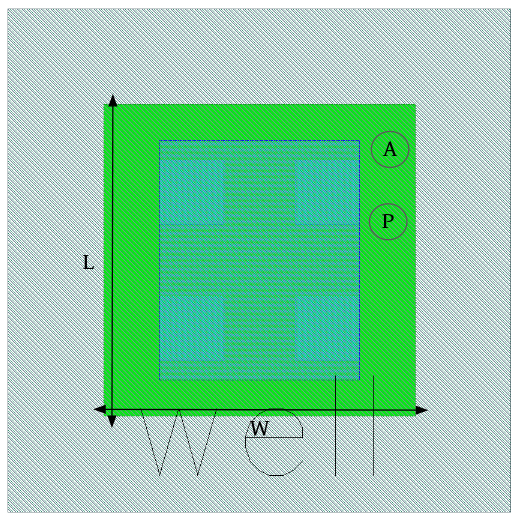

Tap-Devices
===========

ptap1
-----

**Device Information**

.. list-table:: P-well (substrate) diffusion contact.
   :header-rows: 1
   :stub-columns: 1

   * - Property
     - Value
   * - Description
     - Substrate contact which keeps the substrate a separate net.
   * - Device Recognition
     - Activ, pSD, Substrate
   * - Model Name
     - ptap1
   * - Layout Cell Name
     - sg13g2_pr - ptap1
   * - Parameters
     - W, L, A, Perim, R
   * - Additional Notes
     - The resistance value is not accurate (~  262 Ω)

**Parameters Information**

.. list-table:: Schematic and LVS views Compatibility for ptap1 Parameters
   :header-rows: 1
   :stub-columns: 1

   * - Parameter
     - Description
     - Schematic-View
     - LVS-View
     - LVS-Comparison
   * - W
     - Active width
     - ❌
     - ✅
     - ✅
   * - L
     - Active length
     - ❌
     - ✅
     - ✅
   * - A
     - Active area
     - ❌
     - ✅
     - ❌
   * - Perim
     - Active perimeter
     - ❌
     - ✅
     - ❌
   * - R
     - Resistance Value
     - ❌
     - ✅
     - ✅

**Layout Information** (Refer to :ref:`layout layers`)

.. rst-class:: center

    Figure 4.9.1 Layout for ptap1 device

ntap1
-----

**Device Information**

.. list-table:: N-well diffusion contact.
   :header-rows: 1
   :stub-columns: 1

   * - Property
     - Value
   * - Description
     - Nwell contact which keeps the nwell a separate net.
   * - Device Recognition
     - Activ, Nwell, nBuLay
   * - Model Name
     - ntap1
   * - Layout Cell Name
     - sg13g2_pr - ntap1
   * - Parameters
     - W, L, A, Perim, R
   * - Additional Notes
     - The resistance value is not accurate (~  262 Ω)

**Parameters Information**

.. list-table:: Schematic and LVS views Compatibility for ntap1 Parameters
   :header-rows: 1
   :stub-columns: 1

   * - Parameter
     - Description
     - Schematic-View
     - LVS-View
     - LVS-Comparison
   * - W
     - Active width
     - ❌
     - ✅
     - ✅
   * - L
     - Active length
     - ❌
     - ✅
     - ✅
   * - A
     - Active area
     - ❌
     - ✅
     - ❌
   * - Perim
     - Active perimeter
     - ❌
     - ✅
     - ❌
   * - R
     - Resistance Value
     - ❌
     - ✅
     - ✅

**Layout Information** (Refer to :ref:`layout layers`)

.. rst-class:: center

    Figure 4.9.2 Layout for ntap1 device
