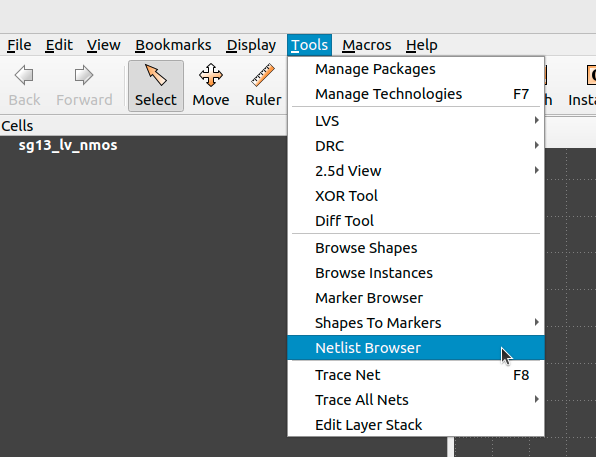
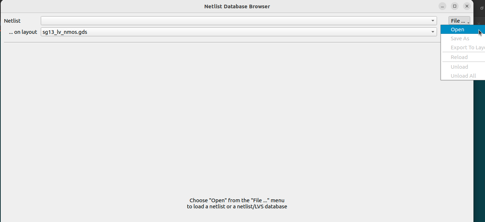
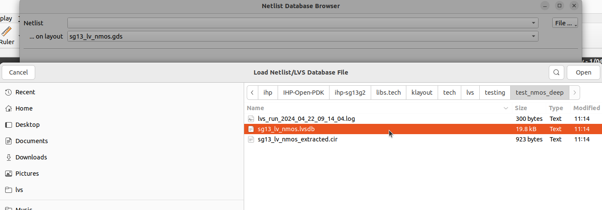
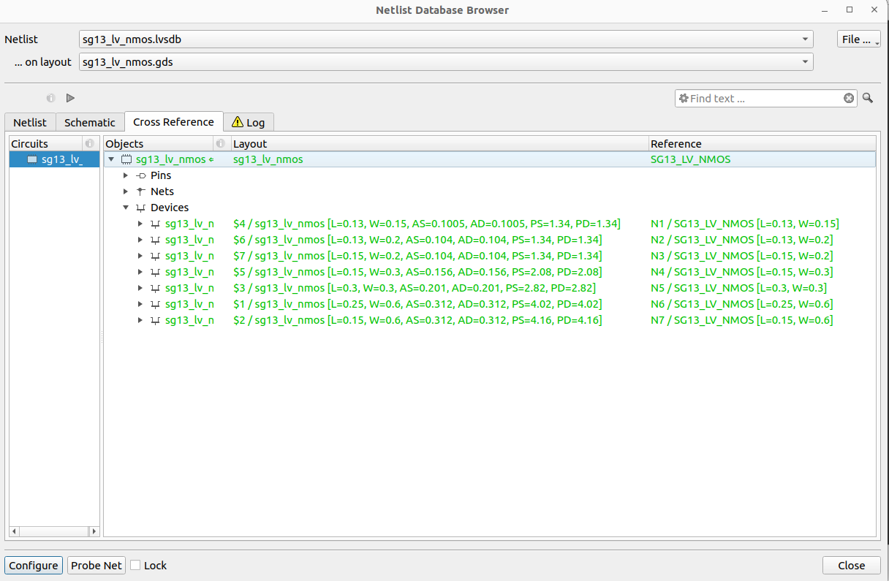
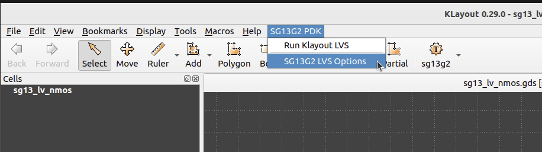
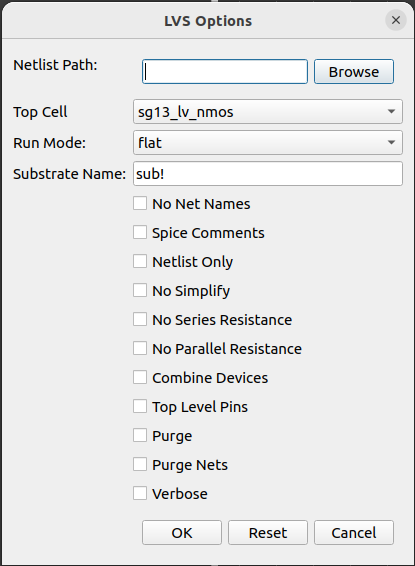
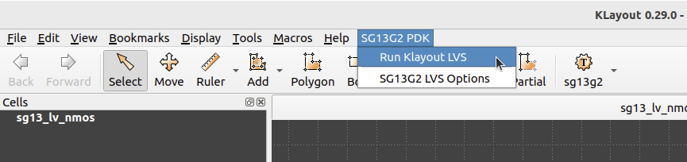

Usage
=====

.. note::
    You have the option to execute the SG13G2-LVS through either a Python script via the command-line interface (CLI). or by the Klayout graphical user interface (GUI)., as detailed in the subsequent usage sections.

.. _CLI Usage:

CLI
---

The `run_lvs.py` script takes your gds and netlist files to run LVS rule decks with switches to select subsets of all checks.

.. code-block:: bash

    run_lvs.py (--help| -h)
    run_lvs.py (--layout=<layout_path>) (--netlist=<netlist_path>)
    [--run_dir=<run_dir_path>] [--topcell=<topcell_name>] [--run_mode=<run_mode>]
    [--no_net_names] [--spice_comments] [--net_only] [--no_simplify]
    [--no_series_res] [--no_parallel_res] [--combine_devices] [--top_lvl_pins]
    [--purge] [--purge_nets] [--verbose]

**Options:**

.. code-block:: rst

    `--help -h`                         Displays this help message.
    `--layout=<layout_path>`            Specifies the file path of the input GDS file.
    `--netlist=<netlist_path>`          Specifies the file path of the input netlist file.
    `--run_dir=<run_dir_path>`          Run directory to save all the generated results [default: pwd]
    `--topcell=<topcell_name>`          Specifies the name of the top cell to be used.
    `--run_mode=<run_mode>`             Selects the allowed KLayout mode. (flat, deep). [default: flat]
    `--no_net_names`                    Omits net names in the extracted netlist.
    `--spice_comments`                  Includes netlist comments in the extracted netlist.
    `--net_only`                        Generates netlist objects only in the extracted netlist.
    `--no_simplify`                     Disables simplification for both layout and schematic netlists.
    `--no_series_res`                   Prevents simplification of series resistors for both layout and schematic.
    `--no_parallel_res`                 Prevents simplification of parallel resistors for both layout and schematic.
    `--combine_devices`                 Enables device combination for both layout and schematic netlists.
    `--top_lvl_pins`                    Creates pins for top-level circuits in both layout and schematic netlists.
    `--purge`                           Removes unused nets from both layout and schematic netlists.
    `--purge_nets`                      Purges floating nets from both layout and schematic netlists.
    `--verbose`                         Enables detailed rule execution logs for debugging purposes.

.. note::

    * By utilizing the `no_simplify` option, you can prevent layout simplification for both layout and schematic netlists. Simplification is enabled by default, incorporating steps such as `make_top_level_pins`, `purge`, `combine_devices`, and `purge_nets`.

    * When you use the `no_simplify` option to disable simplification, you can then use the `make_top_level_pins`, `purge`, `combine_devices`, and `purge_nets` options individually to fine-tune the behavior according to your needs.

    * Series resistors with identical parameters (except length) will combine into one resistor with the total length.

    * Parallel resistors will merge into a single resistor with the parameter `m` representing the number of parallel resistors, provided they share identical parameters.

    * The options `no_series_res` and `no_parallel_res` are specifically designed to disable layout simplification for resistors exclusively. When specified, they take priority over `combine_devices` option.

**Example:**

.. code-block:: bash

    python3 run_lvs.py --layout=testing/testcases/unit/mos_devices/layout/sg13_lv_nmos.gds --netlist=testing/testcases/unit/mos_devices/netlist/sg13_lv_nmos.cdl --run_dir=test_nmos

**LVS Outputs**

You could find the run results at your run directory if you previously specified it through `--run_dir=<run_dir_path>`. Default path of run directory is `lvs_run_<date>_<time>` in current directory.

Folder Structure of run results

.. code-block:: rst

    📁 lvs_run_<date>_<time>
    ┗ 📜 lvs_run_<date>_<time>.log
    ┗ 📜 <your_design_name>.cir
    ┗ 📜 <your_design_name>.lvsdb

The outcome includes a database file for each device (`<device_name>.lvsdb`) containing LVS extractions and comparison results. You can view it by opening your gds file with: `klayout <device_name>.gds -mn <device_name>.lvsdb`. Alternatively, you can visualize it on your GDS file using the netlist browser option in the tools menu of the KLayout GUI as illustrated in the following figures.

.. rst-class:: center

    Figure 5.4.1 Netlist Browser for Klayout-LVS

After selecting Netlist Browser option, you could load the database file and visualize the LVS results.

.. rst-class:: center

    Figure 5.4.2 Loading LVS Netlist/database file - 1

.. rst-class:: center

    Figure 5.4.3 Loading LVS Netlist/database file - 2

.. rst-class:: center

    Figure 5.4.4 Visualize LVS results

Additionally, you can find the extracted netlist generated from your design at (`<device_name>_extracted.cir`) in the output run directory.

GUI
---

The SG13G2 also facilitates LVS execution via Klayout menus as depicted below:

First, you need to add the LVS menus to your `KLAYOUT_PATH`, you could do that by executing the following command:

.. code-block:: bash

    KLAYOUT_PATH=$PDKPATH/libs.tech/klayout:$PDKPATH/libs.tech/klayout/tech/ klayout -e

.. tip::
    In this context, `PDKPATH` refers to the path leading to the IHP-Open-PDK/ihp-sg13g2 directory within the current repository.

Then, you will get the LVS menus for SG13G2, you could set your desired options as shown below:

.. rst-class:: center

    Figure 5.4.5 Setting up LVS Options-GUI - 1

.. rst-class:: center

    Figure 5.4.6 Setting up LVS Options-GUI - 2

.. note::
        
    * To utilize the LVS options, an active cell must be present. The currently active cell is automatically chosen as the default for running LVS. You could change it using `Top Cell` option.

    * To conduct the LVS comparison, you must specify the path to the schematic netlist via `Netlist Path` option. If no path is provided, the tool will search for the netlist file automatically. It will look for files with extensions such as .cdl, .spice, or .cir in the same directory as the layout file, matching the name of the layout file.

For additional details on GUI options, please refer to the :ref:`CLI Usage`.

Finally, after setting your option, you could execute the LVS using `Run Klayout LVS` from the dropdown menu.

.. rst-class:: center

    Figure 5.4.7 Running LVS using Klayout menus

Upon executing the LVS, the result database will appear on your layout interface, allowing you to verify the outcome of the run similarly as shown above in Fig. 5.4.4.

Additionally, you can find the extracted netlist generated from your design at (`<layout_name>_extracted.cir`) in the same directory as the layout file.
