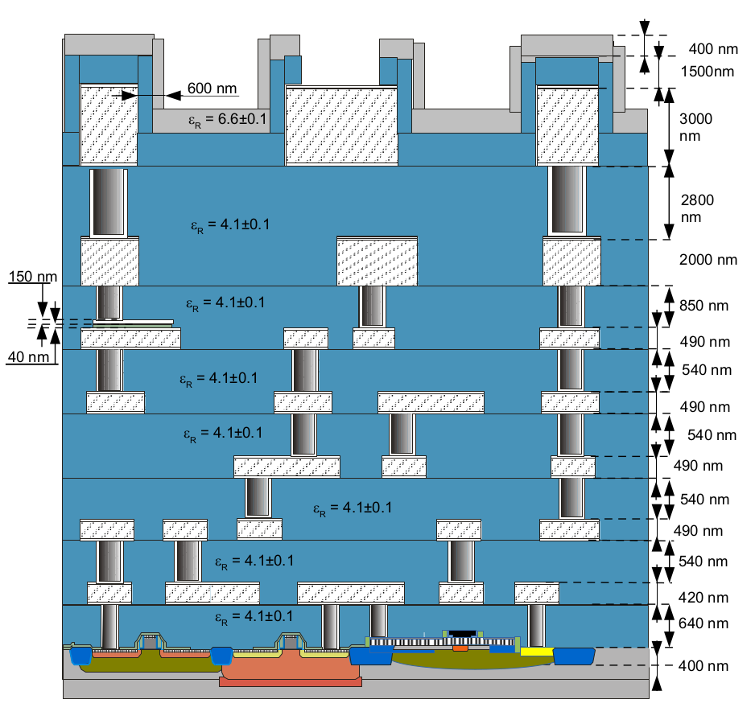
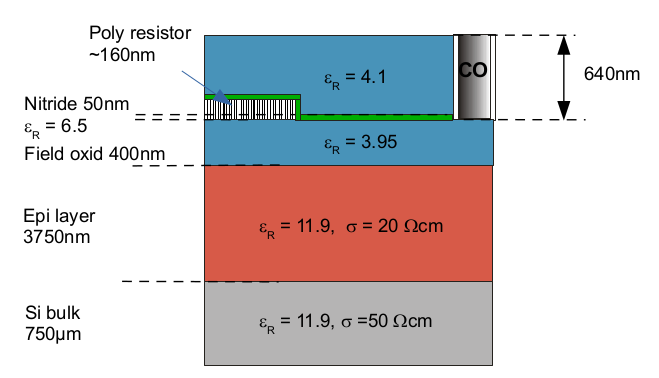

Main Processing Sequence and Cross-Section Schematic
====================================================

**Process Flow**

- Isolation:
    * Shallow trench isolation (STI)
- Well Formation:
    * NWell formation
    * PWell formation
    * Triple Well formation
- Gate Stack:
    * Poly Gate formation
- Active Region Definition:
    * Bipolar Window opening
    * Collector Window opening
    * Emitter opening
- Polysilicon Gates:
    * Emitter Poly definition
    * Base Poly definition
- Source/Drain Formation:
    * nSD implant / drive
    * pSD implant / drive
- Metallization:
    * Salicide formation
    * Contact definition
    * Metal Layer Stack:
        - Metal1
        - Via1
        - Metal2
        - Via2
        - ... (repeat for Metal3, Via3, ..., Metal5)
- Advanced Features:
    * MIM formation (Metal-Insulator-Metal capacitor)
- Top Metal Layers:
    * TopVia1
    * TopMetal1
    * TopVia2
    * TopMetal2
- Finishing Steps:
    * Passivation
- Testing:
    * Parametric test

.. rst-class:: center

    Figure 1.1.1 SG13 process cross-section (not to scale)

.. rst-class:: center

    Figure 1.1.2 BEOL detail cross-section below Metal1 for passive modeling (not to scale).

.. tip::
    - ILDO consists of oxide (590nm) and nitride (50nm).
    - For a homogenous ILDO with εR=4.1 the effective thickness corresponds to deff=620nm.
