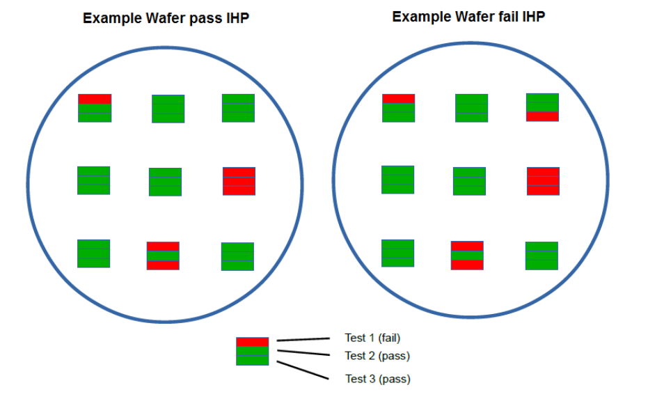

Wafer Reject Criteria
=====================

Pass/fail parameters are measured on nine (or more) sites, distributed uniformly across the wafer. 

At least 2/3 of the measured sites (min. 6 sites) must pass all pass/fail criteria in order to consider the tested wafer
as pass.

**Please refer to the following example. In reality about 50 tests are included.**

.. rst-class:: center

    Figure 1.3 Examples for Pass/Fail IHP-Wafers
