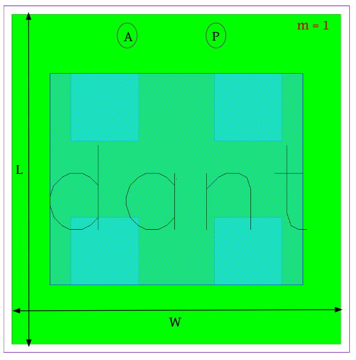
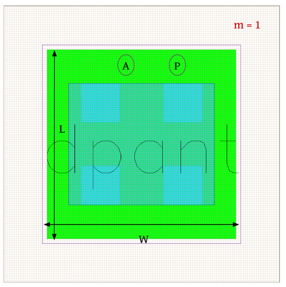
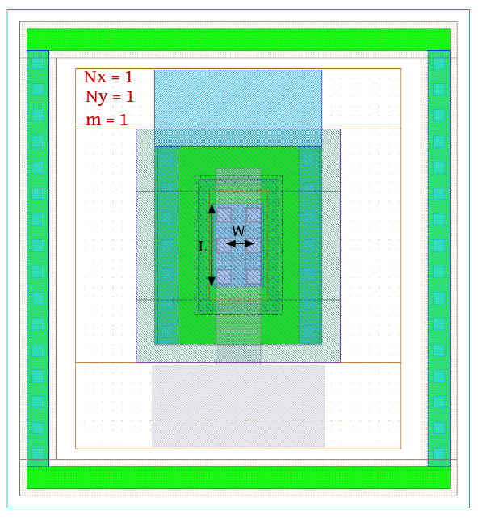

Diode Devices
=============

dantenna
--------

**Device Information**

.. list-table:: Antenna diode - Low voltage protection
   :header-rows: 1
   :stub-columns: 1

   * - Property
     - Value
   * - Description
     - Protection diode for MOS gates. Substrate is anode, metal is cathode.
   * - Device Recognition
     - Activ, Recog.diode
   * - Model Name
     - dantenna
   * - Layout Cell Name
     - sg13g2_pr - dantenna
   * - Parameters
     - w, l, a, p, m
   * - Netlist Syntax
     - `D1 GND net1 dantenna w=780.00n l=780.00n a=608.400f p=3.12u m=1`
   * - Additional Notes
     - The anode of the diode should be connected to the ptap1 resistor.

**Parameters Information**

.. list-table:: Schematic and LVS views Compatibility for dantenna Parameters
   :header-rows: 1
   :stub-columns: 1

   * - Parameter
     - Description
     - Schematic-View
     - LVS-View
     - LVS-Comparison
   * - W
     - Active width
     - ✅
     - ❌
     - ❌
   * - L
     - Active length
     - ✅
     - ❌
     - ❌
   * - A
     - Active area
     - ❌
     - ✅
     - ✅
   * - P
     - Active perimeter
     - ❌
     - ✅
     - ✅
   * - m
     - Number of diodes (multiplicity)
     - ❌
     - ✅
     - ✅

.. tip::
  - You have the option to use either W/L or A/P in your netlist.

**Layout Information** (Refer to :ref:`layout layers`)

.. rst-class:: center

    Figure 4.4.1 Layout for dantenna diode device

dpantenna
---------

**Device Information**

.. list-table:: Antenna diode - High voltage protection
   :header-rows: 1
   :stub-columns: 1

   * - Property
     - Value
   * - Description
     - Protection diode for MOS gates. Substrate is cathode, metal is anode.
   * - Device Recognition
     - Activ, Recog.diode, pSD
   * - Model Name
     - dpantenna
   * - Layout Cell Name
     - sg13g2_pr - dpantenna
   * - Parameters
     - w, l, a, p, m
   * - Netlist Syntax
     - `D1 GND net1 dpantenna w=780.00n l=780.00n a=608.400f p=3.12u m=1`
   * - Additional Notes
     - The cathode of the diode should be connected to the ntap1 resistor.

**Parameters Information**

.. list-table:: Schematic and LVS views Compatibility for dpantenna Parameters
   :header-rows: 1
   :stub-columns: 1

   * - Parameter
     - Description
     - Schematic-View
     - LVS-View
     - LVS-Comparison
   * - W
     - Active width
     - ✅
     - ❌
     - ❌
   * - L
     - Active length
     - ✅
     - ❌
     - ❌
   * - A
     - Active area
     - ❌
     - ✅
     - ✅
   * - P
     - Active perimeter
     - ❌
     - ✅
     - ✅
   * - m
     - Number of diodes (multiplicity)
     - ❌
     - ✅
     - ✅

.. tip::
  - You have the option to use either W/L or A/P in your netlist.

**Layout Information** (Refer to :ref:`layout layers`)

.. rst-class:: center

    Figure 4.4.2 Layout for dpantenna diode device

schottky_nbl1
-------------

**Device Information**

.. list-table:: schottky diode.
   :header-rows: 1
   :stub-columns: 1

   * - Property
     - Value
   * - Description
     - Schottky Diode.
   * - Device Recognition
     - Activ, metal1, NWell, ThickGateOx, SalBlock, nBuLay, pSD, nSD.blk, PWell.blk, Recog.diode
   * - Model Name
     - schottky_nbl1
   * - Layout Cell Name
     - sg13g2_pr - schottky_nbl1
   * - Parameters
     - l, w, m
   * - Netlist Syntax
     - `D1 PLUS1 MINUS1 sub! schottky_nbl1 m=1`
   * - Additional Notes
     - Anode is the activ & metal under SalBlock, cathode is the activ & metal inside Nwell.

**Parameters Information**

.. tip::
  The schottky_nbl1 device come in predetermined sizes, and the only parameter we keep track of is 'm' (multiplicity).

.. list-table:: Schematic and LVS views Compatibility for schottky_nbl1 Parameters
   :header-rows: 1
   :stub-columns: 1

   * - Parameter
     - Description
     - Schematic-View
     - LVS-View
     - LVS-Comparison
   * - W
     - ContBar width (Fixed)
     - ❌
     - ❌
     - ❌
   * - L
     - ContBar length (Fixed)
     - ❌
     - ❌
     - ❌
   * - m
     - Number of schottky diodes (multiplicity)
     - ❌
     - ✅
     - ✅

**Layout Information** (Refer to :ref:`layout layers`)

.. rst-class:: center

    Figure 4.4.3 Layout for schottky_nbl1 diode device
